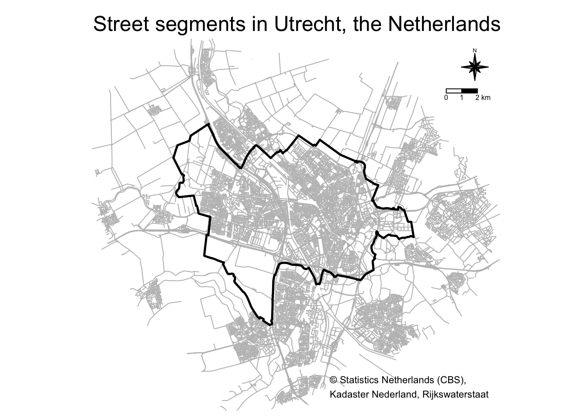
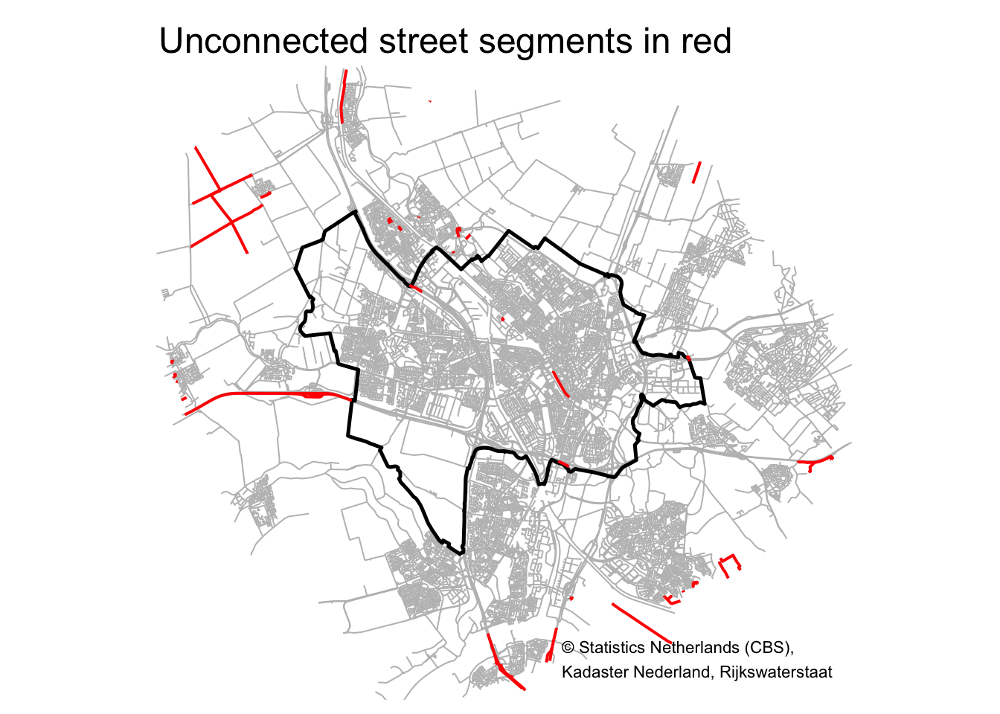
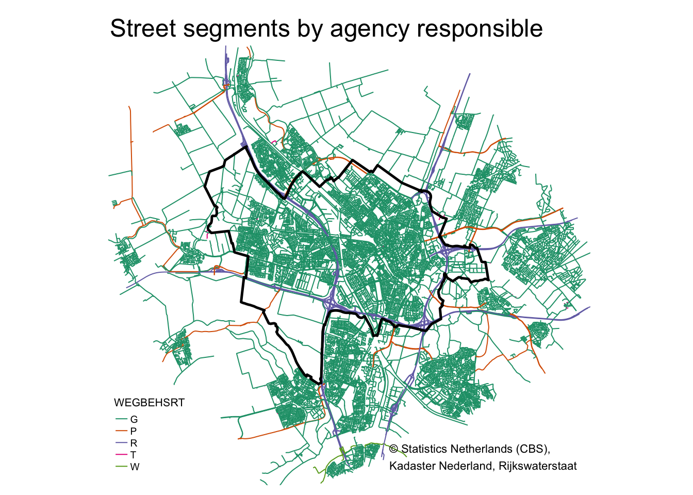
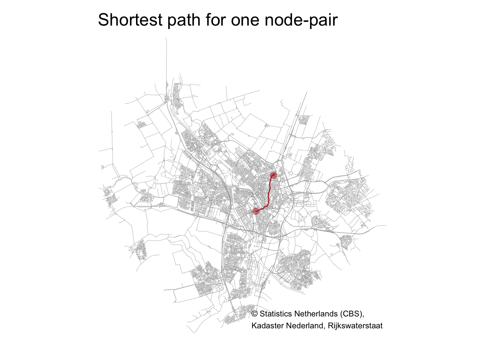
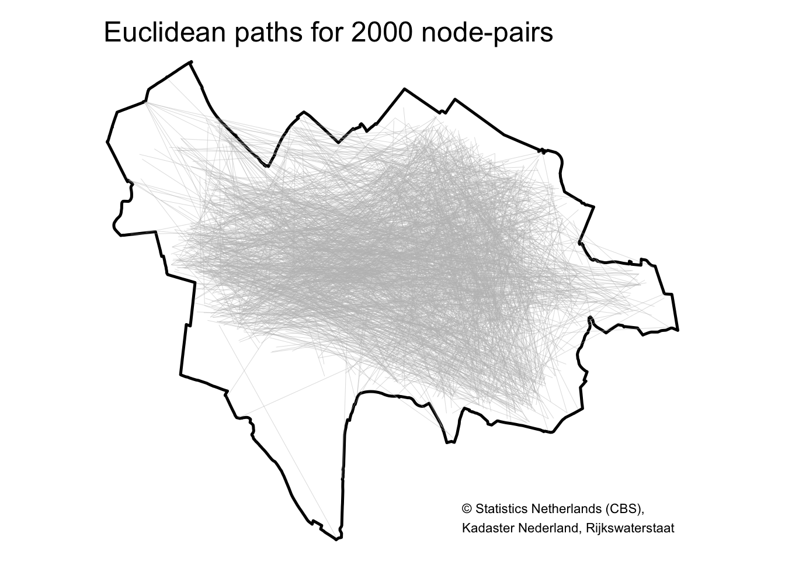
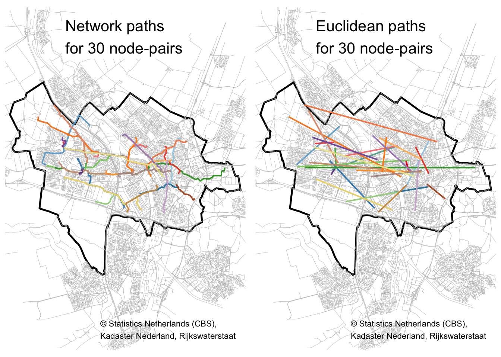
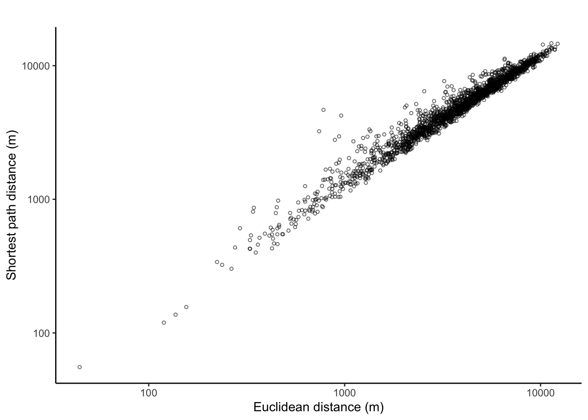
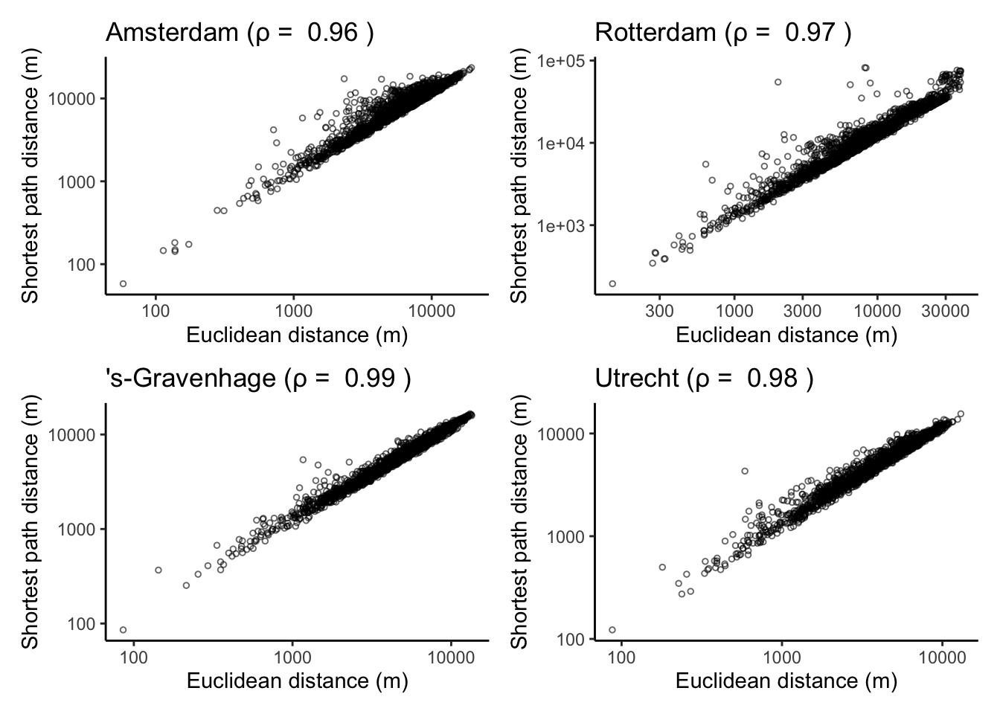

Andy Wheeler has a [blog post](https://andrewpwheeler.com/2015/04/04/some-more-on-network-distances-vs-geographic-distances-intra-city/) comparing geographic distance (as the crow flies) to network distance (following the road network). The tl;dr; is that in Albany, NY, the correlation beween network distance and geographic distance is really high (0.94). As you'd expect the network distance is always larger than the geographic distance, and this becomes a bit more evident for longer routes.^[Outliers for very short routes are likely due to one-way streets: the geographic distance between A and B is very short, but you have to take quite a detour on the road network due to one-way traffic.]

Based on his results, and depending on the application, perhaps we can just calculate Euclidean distances between two points rather than going the complicated route of using network distance calculations (e.g. by using the Google API or ArcGIS). One example is Near Repeat victimization, in which the spatial and temporal distances between pairs of crimes are used to detect space-time interaction (i.e. that houses nearby a house that was burglarized have a higher chance to also be targets for a short period after the first victimization). See [here](https://www.woutersteenbeek.nl/software/nearrepeat/) for my R package on Near Repeat analysis and [here](https://www.woutersteenbeek.nl/publication/steenbeek-wouter-simulation-2021/) for a teaser on a chapter on mechanisms of Near Repeat in [this book](https://www.routledge.com/Agent-Based-Modelling-for-Criminological-Theory-Testing-and-Development/Elffers-Gerritsen/p/book/9780367228521).

However, I wondered if his findings generalize to other areas. In particular, being from the Netherlands where many roads aren't in a neat [block layout](https://en.wikipedia.org/wiki/Taxicab_geometry), are the correlations comparable? In this post, I use R to analyze how geometric distance and road distance compare for the 4 largest municipalities of the Netherlands: Amsterdam, Rotterdam, The Hague and Utrecht.^[*The Hague* is the anglicized version of *Den Haag*, which is what the Dutch call the city. The city's official name, however, is *'s-Gravenhage*, which is also the name in the shapefiles and statistics provided by Statistics Netherlands.] I use R because it's free and I prefer to stay within the same (programming) language to not disrupt workflow.

> **tl;dr;**  Geographic distance and Road distance are highly correlated in the four largest municipalities of the Netherlands.

## Approach

My approach is the same for all municipalities:

1. I start with the [Wijk- en buurtkaart 2019](https://www.cbs.nl/nl-nl/dossier/nederland-regionaal/geografische-data/wijk-en-buurtkaart-2019) (Neighborhood and Districts map) of the Netherlands, provided by [Statistics Netherlands](https://www.cbs.nl). From this shapefie, I extract the outline of a municipality.

2. From the [Nationaal Wegenbestand](https://nationaalwegenbestand.nl/) (National Roadfile) of [Rijkswaterstaat](https://www.rijkswaterstaat.nl) (Ministry of Infrastructure and Water Management) I select the roads that intersect with the municipality outline (including a buffer area). This shapefile of roads is converted to a graph (network object).

3. Next I take a sample of 2000 pairs of intersections and I identify the shortest path along the road network for each of these node-pairs.^[Andy uses a slightly different approach. Of all street segments and intersections in Albany, he first selected the 2,640 street segments and intersections that had 1 reported crime between 2000 through 2013. He argues this is a pretty good proxy for places where people are actually located in the city, so places where people might actually travel from/to. I don't have access to crime data of such detailed spatial scale for the Netherlands, but I could include other data sources to accomplish the same thing. In a follow-up to this post, I may dive into the street segment data some more to not sample from all street segments randomly, but according to where people are most likely to travel to and from.]

4. For these shortest-paths-along-the-road-network, I calculate the total length (i.e., the distance between two nodes along the road network), as well as the geographic distance between these nodes. Actually, I calculate the [Euclidean distance](https://en.wikipedia.org/wiki/Euclidean_distance) because at these relatively short distances we don't have to worry about the [curvature of the Earth](https://en.wikipedia.org/wiki/Geographical_distance).

5. I then calculate the correlation between the geographic distance and the network distance. I use the residuals of a regression analysis to identify outliers. In contrast to Andy, I plot only the routes that have rather high or low residuals and combine these into one map.


## R packages for spatial networks

R has an active ecosystem for spatial analysis (check out the [CRAN task view](https://cran.r-project.org/web/views/Spatial.html) with regard to the Analysis of Spatial Data]). I use [sf](https://cran.r-project.org/package=sf) for handling spatial objects, [tidygraph](https://cran.r-project.org/package=tidygraph) (based on [igraph](https://cran.r-project.org/package=igraph)) for network analysis, [dplyr](https://cran.r-project.org/package=dplyr) for data wrangling, and [ggplot2](https://cran.r-project.org/package=ggplot2) and [tmap](https://cran.r-project.org/package=tmap) for visualization. I borrow from [this post](https://www.r-spatial.org/r/2019/09/26/spatial-networks.html) for many of the spatial analysis steps.

<!-- ```{r}
# Use remotes to install packages, install it if needs be:
if(!"remotes" %in% installed.packages()) {
  install.packages("remotes")
}

cran_pkgs = c(
  "sf",
  "tidygraph",
  "igraph",
  "dplyr",
  "tibble",
  "ggplot2",
  "tmap"
)

remotes::install_cran(cran_pkgs)
```-->


```r
library(sf)
library(tidygraph)
library(igraph)
library(dplyr)
library(ggplot2)
library(tmap)
```


## Getting and plotting the data

Statistics Netherlands provides a [Wijk- en buurtkaart 2019](https://www.cbs.nl/nl-nl/dossier/nederland-regionaal/geografische-data/wijk-en-buurtkaart-2019) shapefile for the entire Netherlands (which also includes statistics per neighborhood, district, and municipality on a variety of subjects). The [Nationaal Wegenbestand (NWB)](https://nationaalwegenbestand.nl/) (National Roadfile) provides all street segments (the pieces of a street between two intersections). After downloading the data and unzipping all the files into folders named "WijkBuurtkaart_2019_v1" and "nwb_01-09-2020" respectively (those are the folder names that the zips created ), I load them:


```r
# Load municipalities shapefile as sf object
# This assumes you have unzipped the "Wijk- en buurtkaart 2019_v1" zip file into a
# subfolder "WijkBuurtkaart_2019_v1" in the current working directory.
muni <- st_read(dsn = "WijkBuurtkaart_2019_v1/gemeente_2019_v1.shp")
```


```r
# load road network as sf object
road_sf <- st_read(dsn = "nwb_01-09-2020/Wegvakken/Wegvakken.shp")
```

Next, I select the municipality of Utrecht, and then create a 5000 meter buffer zone around the municipality. I then select the roads within this buffered-Utrecht polygon.


```r
poly_Utrecht <- muni %>% filter(GM_NAAM == "Utrecht")
poly_Utrecht_buffer <- st_buffer(poly_Utrecht, 5000)
road_Utrecht <- road_sf[poly_Utrecht_buffer, ]
```

Let's plot these spatial data. 


```r
tm_shape(poly_Utrecht_buffer) + tm_borders(col = "white") +
  tm_shape(road_Utrecht) + tm_lines(col = "grey") +
  tm_shape(poly_Utrecht) + tm_borders(col = "black", lwd = 2.5) +
  tm_compass(type = "8star", text.size = 0.4, position = c("right", "top")) +
  tm_scale_bar(breaks = c(0, 1, 2), position = c("right", "top")) +
  tm_credits("© Statistics Netherlands (CBS),\nKadaster Nederland, Rijkswaterstaat", position=c("right", "bottom")) +
  tm_layout(main.title = "Street segments in Utrecht, the Netherlands",
            frame = FALSE)
```



This maps includes a compass and scale bar but I'll omit these in future maps in this post because I follow Jerry Ratcliffe's [mapping tips](https://twitter.com/Jerry_Ratcliffe/status/1220353890769670153) #1 and #2 :wink:. Yeah, yeah, I know. Mapping puritans will have a fit. Maps without the proper annotations?

<iframe src="https://giphy.com/embed/JRF85A7Bcl2YU" width="480" height="236" frameBorder="0" class="giphy-embed" allowFullScreen></iframe>

I could have introduced unconnected sub-graphs in the network. I solve this by identifying and removing these subgraphs.


```r
# See https://github.com/ropensci/stplanr/issues/344
touching_list <- sf::st_touches(road_Utrecht)
graph_list <- igraph::graph.adjlist(touching_list)
roads_groups <- igraph::components(graph_list) 
roads_table <- table(roads_groups$membership)
roads_table_order <- roads_table[order(roads_table, decreasing = TRUE)]
roads_table_order
```

```
## 
##     1    14     7    10    12    18     4    19     9     6    11    20    27 
## 34776    17    14     9     7     7     6     6     5     4     3     3     3 
##    31    33     5    13    16    25    26    30     2     3     8    15    17 
##     3     3     2     2     2     2     2     2     1     1     1     1     1 
##    21    22    23    24    28    29    32    34    35    36    37    38    39 
##     1     1     1     1     1     1     1     1     1     1     1     1     1 
##    40 
##     1
```

I don't lose very many street segments if I remove the unconnected street segments. Let's plot a map of the city, the street segments, and highlight the street segments I'd be deleting.


```r
tm_shape(poly_Utrecht_buffer) + tm_borders(col = "white") +
  tm_shape(road_Utrecht) + tm_lines(col = "grey") +
  tm_shape(poly_Utrecht) + tm_borders(col = "black", lwd = 2.5) +
  tm_shape(road_Utrecht[roads_groups$membership > 1, ]) + tm_lines(col = "red", lwd = 2) +
  # tm_compass(type = "8star", text.size = 0.4, position = c("right", "top")) +
  # tm_scale_bar(breaks = c(0, 1, 2), position = c("right", "top")) +
  tm_credits("© Statistics Netherlands (CBS),\nKadaster Nederland, Rijkswaterstaat", position=c("right", "bottom")) +
  tm_layout(main.title = "Unconnected street segments in red",
            frame = FALSE)
```



Most of the red street segments are located outside the municipality. I inspected the one street segment in the city center, parallel to the train tracks, and I think this segment shouldn't be there anyway (Google Maps also doesn't show this segment).


```r
# roads_table_order # We don't lose a whole lot
biggest_group <- names(roads_table_order[1])
road_Utrecht <- road_Utrecht[roads_groups$membership == biggest_group, ]
```

Let's plot these data:


```r
tm_shape(poly_Utrecht_buffer) + tm_borders(col = "white") +
  tm_shape(road_Utrecht) + tm_lines(col = "WEGBEHSRT", palette = "Dark2") +
  tm_shape(poly_Utrecht) + tm_borders(col = "black", lwd = 2.5) +
  # tm_compass(type = "8star", text.size = 0.4, position = c("right", "top")) +
  # tm_scale_bar(breaks = c(0, 1, 2), position = c("right", "top")) +
  tm_credits("© Statistics Netherlands (CBS),\nKadaster Nederland, Rijkswaterstaat", position=c("right", "bottom")) +
  tm_layout(main.title = "Street segments by agency responsible", 
            frame = FALSE, 
            legend.position = c("left","bottom"),
            legend.title.size = .8,
            legend.text.size = .6)
```



The segments for which "WEGBEGSRT" equals "R" refer to motorways, i.e. controlled-access roads for high-speed vehicular traffic. For this analysis I will keep these types of roads in, although in a follow-up post it could be interesting to remove these and see how this affects results.

The next steps gives each edge in the roads `sf` object a unique index, creates nodes at the start and end of each edge, gives each node a unique index, combines the node indices with the edges, and removes duplicate nodes. Finally, I end up with a `tbl_graph` object. All these steps are detailed in [this post](https://www.r-spatial.org/r/2019/09/26/spatial-networks.html), although I adjusted the code somewhat because `dplyr::group_indices()` is getting deprecated and `cur_group_id()` should be used instead.


```r
sf_to_tidygraph = function(x, directed = TRUE) {
  
  # Give edges a unique index
  edges <- x %>%
    mutate(edgeID = c(1:n()))
  
  # Extract beginning and end node for each edge
  nodes <- edges %>%
    st_coordinates() %>%
    as_tibble() %>%
    rename(edgeID = L1) %>%
    group_by(edgeID) %>%
    slice(c(1, n())) %>%
    ungroup() %>%
    mutate(start_end = rep(c('start', 'end'), times = n()/2)) %>%
    mutate(xy = paste(.$X, .$Y)) %>% 
    mutate(xy = factor(xy, levels = unique(xy))) %>%
    group_by(xy) %>%
    mutate(nodeID = cur_group_id()) %>%
    ungroup() %>%
    select(-xy)
  
  source_nodes <- nodes %>%
    filter(start_end == 'start') %>%
    pull(nodeID)

  target_nodes <- nodes %>%
    filter(start_end == 'end') %>%
    pull(nodeID)

  # Specify for each edge in which node it starts and in which node it ends
  edges <- edges %>%
    mutate(from = source_nodes, to = target_nodes)
  
  # Remove duplicate nodes and convert to sf object with correct CRS
  nodes <- nodes %>%
    distinct(nodeID, .keep_all = TRUE) %>%
    select(-c(edgeID, start_end)) %>%
    st_as_sf(coords = c('X', 'Y')) %>%
    st_set_crs(st_crs(edges))
  
  # Convert to tbl_graph object
  tbl_graph(nodes = nodes, edges = as_tibble(edges), directed = directed)
  
}

graph <- sf_to_tidygraph(road_Utrecht, directed = FALSE)
```

I now have a the road network stored in a tbl_graph structure, with a geometry list column for both the edges and nodes. With the `activate()` verb, you can specify if you want to manipulate the edges or the nodes, after which `dplyr` verbs can be used.

## Calculating road (shortest path) distance and Euclidean distance for a sample of nodes

To calculate shortest path distances between two nodes, I need the length of all street segments, so I first create this variable using the `st_length()` function.


```r
graph <- graph %>%
  activate(edges) %>%
  mutate(length = st_length(geometry))
```

I also add the X and Y of all nodes as variables to the sf object:


```r
graph <- graph %>%
  activate(nodes) %>%
  mutate(X = st_coordinates(geometry)[, 1],
         Y = st_coordinates(geometry)[, 2])
```

Calculating the shortest routes (and euclidean distances) between all nodes in the network is a bit too much, as the total number of paths is $n*n$ ($n$ = the number of nodes). Actually, this is only $n*n$ if the path from A to B is different from the path from B to A (for all nodes). Clearly for the geometric path---as the crow flies---the distance from A to B is the same as the distance from B to A. For the shortest network path the distance is also the same if every street is two-way traffic. I'm not doing this exercise with Google's API---that takes into account one-way traffic street segments---but with a shapefile of the Dutch street network, and I will assume every street segment can be traveled both ways. (For within-city/village streets this sort of makes sense in the Netherlands, because the Dutch bike a lot, and I don't know of many one-way bike paths.)

I'm only interested in nodes that start or end in the municipality of Utrecht, but the shortest path between the two might use a street segment just outside the municipality border: for that reason I created the buffer zone around the municipality. I first identify these nodes:


```r
# Select only nodes that are within the muncipality border.
nodes_in_Utrecht <- graph %>% activate(nodes) %>% as_tibble() %>% st_as_sf()
nodes_in_Utrecht <- nodes_in_Utrecht[poly_Utrecht, ]

# Total number of nodes within Utrecht municipality
n_nodes <- nrow(nodes_in_Utrecht)
n_nodes
```

```
## [1] 10773
```

There are 10773 nodes in this graph of Utrecht. The total number of pairs of two nodes, assuming A-B is the same as B-A, is $\frac{1}{2}n*(n-1)$: the number of nodes squared (the number of elements in a $n*n$ matrix), minus the number of nodes (the diagonal of this matrix), divided by two (half of this matrix, as the other half is the same). These are still many many node-pairs, which means I'll be waiting forever on these calculations. Instead, I take a sample of 4000 nodes and randomly match these together to form 2000 node-pairs. These are the from/start (`id1`) and to/end (`id2`) points of 2000 paths.


```r
# The nodeID of the nodes within the muncicipality border
nodesIDs_in_Utrecht <- nodes_in_Utrecht %>% pull(nodeID)

# random seed to make reproducible
set.seed(463470)

# Sample 4000 nodeIDs with replacement and save as two-column matrix. One row = 1 path.
nodeIDs_sample <- matrix(data = sample(nodesIDs_in_Utrecht, 4000, replace = TRUE), ncol = 2, byrow = TRUE)
colnames(nodeIDs_sample) <- c("id1", "id2")

# The first six node-pairs are:
head(nodeIDs_sample)
```

```
##        id1   id2
## [1,] 11243 19910
## [2,] 20136  4269
## [3,] 15856  8653
## [4,]  3446 12949
## [5,]  8790 14615
## [6,] 13949 11524
```

## One path

Let's see how this works for one path, the first one in the set of 2000 paths. I call the `shortest_paths()` function to calculate the shortest path for the first node-pair (from node with ID 11243 to node with ID 19910) using the length of each street segment as weights. I use `subgraph.edges()` on the `tbl_graph` object to extract this subgraph.


```r
# get the first from and to node in the sample of 2000 paths
from_node <- nodeIDs_sample[1, 1]
to_node <- nodeIDs_sample[1, 2]

# Calculate shortest path between these
path <- shortest_paths(
  graph = graph,
  from = from_node,
  to = to_node,
  weights = graph %>% activate(edges) %>% pull(length),
  output = "both"
)

# Extract this path from the graph object
path_graph <- graph %>%
  subgraph.edges(eids = path$epath %>% unlist()) %>%
  as_tbl_graph()
```

Plot by starting with the graph, activating the edges using `activate(edges)`, and then turning the object into an sf object using `%>% as_tibble() %>% st_as_sf()`:


```r
# tmap is used to plot all street segments in grey,
# then plot the one identified path_graph-turned-into-sf-object in firebrick red,
# and plotting the begin and end point of this path in firebrick red.

tm_shape(graph %>% activate(edges) %>% as_tibble() %>% st_as_sf()) + tm_lines(lwd = .4, col = "darkgrey") +
  tm_shape(path_graph %>% activate(edges) %>% as_tibble() %>% st_as_sf()) + tm_lines(col = "firebrick", lwd = 1.5) +
  tm_shape(graph %>% activate(nodes) %>% filter(nodeID %in% c(from_node, to_node)) %>% as_tibble() %>% st_as_sf()) + tm_symbols(size = .5, shape = 16, col = "firebrick", alpha = .5) +
  tm_layout(main.title = "Shortest path for one node-pair",
            frame = FALSE) +
  tm_credits("© Statistics Netherlands (CBS),\nKadaster Nederland, Rijkswaterstaat", position=c("right", "bottom"))
```



The length of this path is:


```r
path_graph %>%
  activate(edges) %>%
  as_tibble() %>%
  summarise(length = sum(length)) %>%
  pull(length)
```

```
## 5019.39 [m]
```

The Euclidean distance is of course calculated by $\sqrt{(x_1-x_2)^2+(y_1-y_2)^2}$.^[I calculate the [Euclidean distance](https://en.wikipedia.org/wiki/Euclidean_distance) because at these relatively short distances we don't have to worry about the [curvature of the Earth](https://en.wikipedia.org/wiki/Geographical_distance).] I'll create a function `eucl_distance()` that accepts as input two two-column matrices, the first for the XY of starting nodes, and the second for the XY of the end nodes. The Euclidean distance between these two points is:


```r
eucl_distance <- function(node1_xy, node2_xy){
  as.numeric(sqrt((node1_xy[, 1] - node2_xy[, 1])^2 + (node1_xy[, 2] - node2_xy[, 2])^2))
}

eucl_distance(node1_xy = graph %>% activate(nodes) %>% 
                           filter(nodeID %in% c(from_node)) %>% 
                           select(X, Y) %>% as_tibble,
              node2_xy = graph %>% activate(nodes) %>% 
                           filter(nodeID %in% c(to_node)) %>% 
                           select(X, Y) %>% as_tibble)
```

```
## [1] 3799.295
```

## Many paths

Let's scale this up to do all 2000 paths. But before we get to the 2000 shortest paths, let's first look at the euclidean distance (as the crow flies) for all 2000 node-pairs. To do this, I create an sf object that consists of 2000 linestrings, one for each node-pair:


```r
# Get the coordinates of the begin and end points, and create a tibble
eucl_lines <- nodeIDs_sample %>%
  as_tibble() %>%
  left_join(y = graph %>% activate(nodes) %>% as_tibble %>% select(-geometry), by = c("id1" = "nodeID")) %>%
  left_join(y = graph %>% activate(nodes) %>% as_tibble %>% select(-geometry), by = c("id2" = "nodeID"), suffix = c("_1", "_2"))

# Convert this tibble into a linestring sf object
# I split-apply-combine per row.
rows <- split(eucl_lines, seq(nrow(eucl_lines)))
lines <- lapply(rows, function(row) {
    lmat <- matrix(unlist(row[3:6]), ncol = 2, byrow = TRUE)
    st_linestring(lmat)
  })
lines <- st_sfc(lines)
lines_sf <- st_sf("pathID" = seq_len(nrow(eucl_lines)), "geometry" = lines, crs = st_crs(muni)) %>%
  mutate(pathID = factor(pathID))
```

The object `lines_sf` now has all the 2000 straight lines between each start and end node. Let's plot all of these to see how much they cover the city of Utrecht.


```r
tm_shape(poly_Utrecht) + tm_borders(col = "black", lwd = 2.5) +
  tm_shape(lines_sf) + tm_lines(col = "grey", lwd = .4, alpha = .6) +
  tm_layout(main.title = "Euclidean paths for 2000 node-pairs", frame = FALSE) +
  tm_credits("© Statistics Netherlands (CBS),\nKadaster Nederland, Rijkswaterstaat", position=c("right", "bottom"))
```



This looks pretty good! The southeast area doesn't have many street segments so it makes sense that the straight lines between the 2000 node-pairs don't cover this area.

Next, I calculate the shortest paths for all 2000 node-pairs. Most of the code is exactly the same but I use `lapply()` to save the 2000 results in a list. (Using `lapply()` is the same as first setting up an empty list, and then using a `for()` loop to fill this list.)


```r
# Identify the 2000 paths and save in a list
mypaths <- lapply(seq_len(nrow(nodeIDs_sample)), function(i){
  shortest_paths(
    graph = graph,
    from = nodeIDs_sample[i, 1],
    to = nodeIDs_sample[i, 2],
    weights = graph %>% activate(edges) %>% pull(length),
    output = "both"
    )
})

# Overwrite object mypaths with a list of tbl_graph objects
mypaths <- lapply(mypaths, function(x){
  path_graph <- graph %>%
    subgraph.edges(eids = x$epath %>% unlist()) %>%
    as_tbl_graph()
  return(path_graph)
})

# Convert every path to an sf object so you have a list of 2000 sf objects,
# then merge all 2000 together into one sf object,
# including a pathID variable.
paths_sf <- lapply(mypaths, function(x){
  mysf <- x %>%
    activate(edges) %>%
    as_tibble() %>%
    st_as_sf()
  return(mysf)
}) %>%
  bind_rows(.id = "pathID") %>%
  mutate(pathID = factor(as.numeric(pathID)))
```

Let's plot 30 of the shortest paths and straight lines side-by-side, to get a feel for the differences:


```r
# The first thirty
sample_paths <- 1:30

# Create a new sf object with just these 30 paths
# Create a new pathID factor variable with only 30 levels
paths_sf2 <- paths_sf %>%
  filter(pathID %in% sample_paths) %>%
  mutate(pathID = factor(pathID))

# Plot these paths, save as object
path_plot <- tm_shape(poly_Utrecht) + tm_borders(col = "black", lwd = 2.5) +
  tm_shape(road_Utrecht) + tm_lines(col = "grey", lwd = .4) +
  tm_shape(paths_sf2) + tm_lines(col = "pathID", lwd = 2, palette = "Paired") +
  tm_layout(title = "Network paths\nfor 30 node-pairs", title.bg.color = "white", title.position = c("center", "top"), frame = FALSE, legend.show = FALSE) +
  tm_credits("© Statistics Netherlands (CBS),\nKadaster Nederland, Rijkswaterstaat", position=c("right", "bottom"))

# Do the same for the straight lines
# # Create a new pathID factor variable with only 30 levels
lines_sf2 <- lines_sf %>%
  filter(pathID %in% sample_paths) %>%
  mutate(pathID = factor(pathID))

# Plot these straight lines, save as object
euc_plot <- tm_shape(poly_Utrecht) + tm_borders(col = "black", lwd = 2.5) +
  tm_shape(road_Utrecht) + tm_lines(col = "grey", lwd = .4) +
  tm_shape(lines_sf2) + tm_lines(col = "pathID", lwd = 2, palette = "Paired") +
  tm_layout(title = "Euclidean paths\nfor 30 node-pairs", title.bg.color = "white", title.position = c("center", "top"), frame = FALSE, legend.show = FALSE) +
  tm_credits("© Statistics Netherlands (CBS),\nKadaster Nederland, Rijkswaterstaat", position=c("right", "bottom"))

# Plot maps side-by-side
tmap_arrange(path_plot, euc_plot)
```




## Shortest path distance vs euclidean distance

Do these 30 road-network paths and straight lines look about the same length? Let's just calculate the lengths between all 2000 pairs of nodes:


```r
# total length of all network paths
lengths_network <- paths_sf %>%
  group_by(pathID) %>%
  summarise(length_path = sum(length)) %>%
  as_tibble() %>%
  select(-geometry)

# Make tibble of starting points
points1 <- nodeIDs_sample %>%
  as_tibble() %>%
  select(id1) %>%
  left_join(y = graph %>% activate(nodes) %>% as_tibble(), 
            by = c("id1" = "nodeID"))

# Make tibble of end points
points2 <- nodeIDs_sample %>%
  as_tibble() %>%
  select(id2) %>%
  left_join(y = graph %>% activate(nodes) %>% as_tibble(), 
            by = c("id2" = "nodeID"))

# Euclidean distance
lengths_eucl <- tibble(pathID = factor(seq_len(nrow(nodeIDs_sample))),
                       length_eucl = eucl_distance(
                                           points1[, c("X", "Y")] %>% as.matrix(),
                                           points2[, c("X", "Y")] %>% as.matrix()))

# Join these into one tibble
lengths_tbl <- lengths_network %>%
  left_join(y = lengths_eucl, by = "pathID")

# The length of the straight line path must always be smaller than 
# or equal to the road-network path:
with(lengths_tbl, table(length_eucl <= length_path)) # yes
```

And plot the result (axes are logged):


```r
ggplot(data = lengths_tbl, aes(x = length_eucl, y = length_path)) +
  geom_point(size = 1, shape = 1, alpha = .6) +
  labs(title = "",
       x = "Euclidean distance (m)", y = "Shortest path distance (m)") +
  theme_classic() +
  scale_x_continuous(trans='log10') +
  scale_y_continuous(trans='log10')
```



The pearson correlation (`with(lengths_tbl, cor(log(length_eucl), log(length_path)))`) is, as expected, very high: 0.98.

## Where are the outliers?

Replicating Andy's post, I use the Studentized residuals of a regression analysis to identify outliers. In contrast to Andy, I plot only the straight lines that have rather high (> 1.5) or low (< -1.5) Studentized residuals and combine these into one interactive map. Because the positive residuals can get very big, I recoded all residuals higher than +5 to +5. I use the Stamen.Toner background map because this black-and-white map shows the important parts of the city but doesn't conflict with the lines drawn.


```r
# Linear regression model
my_reg <- lm(log(length_path) ~ log(length_eucl), data = lengths_tbl)

# Extract Studentized residuals
residuals_tbl <- tibble(pathID = factor(seq_len(length(my_reg$residuals))),
                        residuals_st = rstudent(my_reg))

# Add these back to the lines_sf object
lines_sf <- lines_sf %>%
  left_join(residuals_tbl, by = "pathID")

# Create adjusted lines_sf for plot
lines_sf_resid <- lines_sf %>% 
  filter(residuals_st < -1.5 | residuals_st > 1.5) %>%
  mutate(residuals_st = ifelse(residuals_st > 3, 3, residuals_st)) %>%
  mutate(residuals_st = ifelse(residuals_st < -3, -3, residuals_st))

# Create tmap
mymap <- tm_shape(poly_Utrecht) + tm_borders(col = "forestgreen", lwd = 3.5) +
  tm_shape(lines_sf_resid) + tm_lines(col = "residuals_st", lwd = 2, palette = "-RdBu", title.col = "St. Residuals", midpoint = 0) +
  tm_layout(frame = FALSE)
```


```r
# Plot interactive map
tmap_leaflet(mymap + tm_basemap("Stamen.Toner"), mode = "view", show = FALSE)
```

<iframe src="geometric-road-distance-g4-figures/resid_loc.html" width="100%" height="480px"></iframe>

The lowest residuals are for node-pairs that are in the city's downtown area. Many positive residuals---so the shortest path along the road network is quite a bit longer than the mean prediction of the regression line---are when the nodes of a node-pair are separated by major thoroughfares or train tracks. Many refer to node-pairs from/to Vleuten-De Meern and Leidsche Rijn to/from Overvecht and Noordwest. These residuals are likely due to the need to cross the Amsterdam-Rijnkanaal (a canal) on these routes.


## The four largest municipalities in the Netherlands?

How about the relationship between road distance and network distance for the largest 4 municipalities in the Netherlands? To do this, I repeat the steps above for every municipality, leading to one correlation coefficient per municipality. I then summarize the distribution of these coefficients.

To do this, I first put all the code in a function. This function I can then call for each municipality in turn. I also create the correlation plot and the residuals map, and by default display the map. The output object is a list with (1) a tibble with the calculated Pearson correlation, (2) the correlation plot between logged euclidean distance and logged network distance.


```r
calculate_correlation <- function(municipality_name, n_node_pairs = 2000, print_corr = FALSE){

  print(municipality_name)

  # select polygon and roads
  mypoly <- muni %>% filter(GM_NAAM == municipality_name & WATER == "NEE")
  mypoly_buffer <- st_buffer(mypoly, 5000)
  myroad <- road_sf[mypoly_buffer, ]
  
  # remove unconnected subgraphs
  touching_list <- sf::st_touches(myroad)
  graph_list <- igraph::graph.adjlist(touching_list)
  roads_groups <- igraph::components(graph_list)
  roads_table <- table(roads_groups$membership)
  roads_table_order <- roads_table[order(roads_table, decreasing = TRUE)]
  biggest_group = names(roads_table_order[1])
  myroad <- myroad[roads_groups$membership == biggest_group, ]
  
  sf_to_tidygraph = function(x, directed = TRUE) {
    # Give edges a unique index
    edges <- x %>%
      mutate(edgeID = c(1:n()))
  
    # Extract beginning and end node for each edge
    nodes <- edges %>%
      st_coordinates() %>%
      as_tibble() %>%
      rename(edgeID = L1) %>%
      group_by(edgeID) %>%
      slice(c(1, n())) %>%
      ungroup() %>%
      mutate(start_end = rep(c('start', 'end'), times = n()/2)) %>%
      mutate(xy = paste(.$X, .$Y)) %>%
      mutate(xy = factor(xy, levels = unique(xy))) %>%
      group_by(xy) %>%
      mutate(nodeID = cur_group_id()) %>%
      ungroup() %>%
      select(-xy)
  
    source_nodes <- nodes %>%
      filter(start_end == 'start') %>%
      pull(nodeID)
  
    target_nodes <- nodes %>%
      filter(start_end == 'end') %>%
      pull(nodeID)
  
    # Specify for each edge in which node it starts and in which node it ends
    edges <- edges %>%
      mutate(from = source_nodes, to = target_nodes)
  
    # Remove duplicate nodes and convert to sf object with correct CRS
    nodes <- nodes %>%
      distinct(nodeID, .keep_all = TRUE) %>%
      select(-c(edgeID, start_end)) %>%
      st_as_sf(coords = c('X', 'Y')) %>%
      st_set_crs(st_crs(edges))
  
    # Convert to tbl_graph object
    tbl_graph(nodes = nodes, edges = as_tibble(edges), directed = directed)
  }
  
  graph <- sf_to_tidygraph(myroad, directed = FALSE)

  graph <- graph %>%
    activate(edges) %>%
    mutate(length = st_length(geometry))

  graph <- graph %>%
    activate(nodes) %>%
    mutate(X = st_coordinates(geometry)[,1],
           Y = st_coordinates(geometry)[,2])

  # Select only nodes that are within the muncipality border.
  nodes_in_poly <- graph %>% activate(nodes) %>% as_tibble() %>% st_as_sf()
  nodes_in_poly <- nodes_in_poly[mypoly, ]
  
  # Total number of nodes within municipality
  n_nodes <- nrow(nodes_in_poly)
  # The nodeID of the nodes within the muncicipality border
  nodesIDs_in_poly <- nodes_in_poly %>% pull(nodeID)

  nodeIDs_sample <- matrix(data = sample(nodesIDs_in_poly, n_node_pairs*2, replace = TRUE), ncol = 2, byrow = TRUE)
  colnames(nodeIDs_sample) <- c("id1", "id2")

  # Get the coordinates of the begin and end points, and create a tibble
  eucl_lines <- nodeIDs_sample %>%
    as_tibble() %>%
    left_join(y = graph %>% activate(nodes) %>% as_tibble %>% select(-geometry), by = c("id1" = "nodeID")) %>%
    left_join(y = graph %>% activate(nodes) %>% as_tibble %>% select(-geometry), by = c("id2" = "nodeID"), suffix = c("_1", "_2"))

  # Convert this tibble to a linestring sf object
  # I split-apply-combine per row.
  rows <- split(eucl_lines, seq(nrow(eucl_lines)))
  lines <- lapply(rows, function(row) {
      lmat <- matrix(unlist(row[3:6]), ncol = 2, byrow = TRUE)
      st_linestring(lmat)
    })
  lines <- st_sfc(lines)
  lines_sf <- st_sf("pathID" = seq_len(nrow(eucl_lines)), "geometry" = lines, crs = st_crs(muni)) %>%
    mutate(pathID = factor(pathID))

  # Identify the paths and save in a list
  mypaths <- lapply(seq_len(nrow(nodeIDs_sample)), function(i){
    
    eids <- shortest_paths(
      graph = graph,
      from = nodeIDs_sample[i, 1],
      to = nodeIDs_sample[i, 2],
      weights = graph %>% activate(edges) %>% pull(length),
      output = "both"
      )$epath %>% unlist()
    
    path_graph <- graph %>%
      subgraph.edges(eids = eids) %>%
      as_tbl_graph()
    
    return(path_graph)
  })

  # Convert every path to an sf object so you have a list of 2000 sf objects,
  # then merge all 2000 together into one sf object,
  # with a pathID variable indicating which path every linestring.
  paths_sf <- lapply(mypaths, function(x){
    mysf <- x %>%
      activate(edges) %>%
      as_tibble() %>%
      st_as_sf()
    return(mysf)
  }) %>%
    bind_rows(.id = "pathID") %>%
    mutate(pathID = factor(as.numeric(pathID)))

  # total length of all network paths
  lengths_network <- paths_sf %>%
    group_by(pathID) %>%
    summarise(length_path = sum(length)) %>%
    as_tibble() %>%
    select(-geometry)

  # Make tibble of starting points
  points1 <- nodeIDs_sample %>%
    as_tibble() %>%
    select(id1) %>%
    left_join(y = graph %>% activate(nodes) %>% as_tibble(), 
              by = c("id1" = "nodeID"))

  # Make tibble of end points
  points2 <- nodeIDs_sample %>%
    as_tibble() %>%
    select(id2) %>%
    left_join(y = graph %>% activate(nodes) %>% as_tibble(), 
              by = c("id2" = "nodeID"))

  # Euclidean distance
  eucl_distance <- function(node1_xy, node2_xy){
    sqrt((node1_xy[, 1] - node2_xy[, 1])^2 + (node1_xy[, 2] - node2_xy[, 2])^2)
  }

  lengths_eucl <- tibble(pathID = factor(seq_len(nrow(nodeIDs_sample))),
                         length_eucl = eucl_distance(
                                           points1[, c("X", "Y")],
                                           points2[, c("X", "Y")]) %>% pull(1))

  # Join these into one tibble
  lengths_tbl <- lengths_network %>%
    left_join(y = lengths_eucl, by = "pathID")

  # The length of the straight line path must always be
  # smaller than the road-network path:
  if (!with(lengths_tbl, all(length_eucl <= length_path))){
    print("Not all Euclidean lengths are <= Network lengths ?!!")
  }

  mycorr <- with(lengths_tbl, cor(log(length_eucl), log(length_path)))

  plot_cor <- ggplot(data = lengths_tbl, aes(x = length_eucl, y = length_path)) +
      geom_point(size = 1, shape = 1, alpha = .6) +
      labs(title = "",
           x = "Euclidean distance (m)", y = "Shortest path distance (m)") +
      theme_classic() +
      scale_x_continuous(trans='log10') +
      scale_y_continuous(trans='log10')

  if(print_corr){
    print(plot_cor)
  }

  mytibble <- tibble(muni_name = municipality_name,
                     corr = mycorr)

  return(list(mytibble, plot_cor))
}
```

I can now run the function. Let's try it for the 4 largest municipalities of the Netherlands (Amsterdam, Rotterdam, 's-Gravenhage a.k.a. Den Haag a.k.a. The Hague, and Utrecht), and save the output in a list.


```r
# Suppress summarise() info
options(dplyr.summarise.inform = FALSE)

# Get the 44 municipalities with the most residents
my_muni_names <- muni %>% filter(WATER == "NEE") %>% arrange(desc(AANT_INW)) %>% slice(1:4) %>% pull(GM_NAAM)

# Set seed for reproducibility
set.seed(894)

# Run the function on each municipality in turn, and save as a list
# This will take a while.
output_list <- lapply(my_muni_names, function(muni_name) {
  calculate_correlation(municipality_name = muni_name, print_corr = FALSE)
  })
```

The four correlation plots are:


```r
# Turn the correlations into tibble
corr_tbl <- lapply(output_list, function(x) x[[1]]) %>% bind_rows()

corrplots <- lapply(1:4, function(i){
  output_list[[i]][[2]] + labs(title = paste(as.character(corr_tbl[i, 1]), "(\u03C1 = ", as.character(round(corr_tbl[i, 2], digits = 2)), ")"))
  })

library(patchwork) # Easily combine ggplots.

(corrplots[[1]] + corrplots[[2]]) / (corrplots[[3]] + corrplots[[4]])
```



It turns out geographic distance and Road distance are highly correlated in the four largest cities of the Netherlands. I've also done this for *all* municipalities in the Netherlands (code not included here) and correlations are very high across the board.

## R session info


```r
devtools::session_info()
```

```
## ─ Session info ───────────────────────────────────────────────────────────────
##  setting  value                       
##  version  R version 4.0.0 (2020-04-24)
##  os       macOS Catalina 10.15.7      
##  system   x86_64, darwin17.0          
##  ui       X11                         
##  language (EN)                        
##  collate  en_US.UTF-8                 
##  ctype    en_US.UTF-8                 
##  tz       Europe/Amsterdam            
##  date     2020-09-27                  
## 
## ─ Packages ───────────────────────────────────────────────────────────────────
##  package           * version  date       lib source        
##  abind               1.4-5    2016-07-21 [1] CRAN (R 4.0.0)
##  assertthat          0.2.1    2019-03-21 [1] CRAN (R 4.0.0)
##  backports           1.1.7    2020-05-13 [1] CRAN (R 4.0.0)
##  base64enc           0.1-3    2015-07-28 [1] CRAN (R 4.0.0)
##  callr               3.4.3    2020-03-28 [1] CRAN (R 4.0.0)
##  class               7.3-16   2020-03-25 [1] CRAN (R 4.0.0)
##  classInt            0.4-3    2020-04-07 [1] CRAN (R 4.0.0)
##  cli                 2.0.2    2020-02-28 [1] CRAN (R 4.0.0)
##  codetools           0.2-16   2018-12-24 [1] CRAN (R 4.0.0)
##  colorspace          1.4-1    2019-03-18 [1] CRAN (R 4.0.0)
##  crayon              1.3.4    2017-09-16 [1] CRAN (R 4.0.0)
##  crosstalk           1.1.0.1  2020-03-13 [1] CRAN (R 4.0.0)
##  DBI                 1.1.0    2019-12-15 [1] CRAN (R 4.0.0)
##  desc                1.2.0    2018-05-01 [1] CRAN (R 4.0.0)
##  devtools            2.3.0    2020-04-10 [1] CRAN (R 4.0.0)
##  dichromat           2.0-0    2013-01-24 [1] CRAN (R 4.0.2)
##  digest              0.6.25   2020-02-23 [1] CRAN (R 4.0.0)
##  dplyr             * 1.0.2    2020-08-18 [1] CRAN (R 4.0.2)
##  e1071               1.7-3    2019-11-26 [1] CRAN (R 4.0.0)
##  ellipsis            0.3.1    2020-05-15 [1] CRAN (R 4.0.0)
##  evaluate            0.14     2019-05-28 [1] CRAN (R 4.0.0)
##  fansi               0.4.1    2020-01-08 [1] CRAN (R 4.0.0)
##  farver              2.0.3    2020-01-16 [1] CRAN (R 4.0.0)
##  fs                  1.4.1    2020-04-04 [1] CRAN (R 4.0.0)
##  generics            0.0.2    2018-11-29 [1] CRAN (R 4.0.0)
##  ggplot2           * 3.3.2    2020-06-19 [1] CRAN (R 4.0.2)
##  glue                1.4.1    2020-05-13 [1] CRAN (R 4.0.0)
##  gtable              0.3.0    2019-03-25 [1] CRAN (R 4.0.0)
##  htmltools           0.4.0    2019-10-04 [1] CRAN (R 4.0.0)
##  htmlwidgets       * 1.5.1    2019-10-08 [1] CRAN (R 4.0.0)
##  igraph            * 1.2.5    2020-03-19 [1] CRAN (R 4.0.0)
##  jsonlite            1.6.1    2020-02-02 [1] CRAN (R 4.0.0)
##  KernSmooth          2.23-16  2019-10-15 [1] CRAN (R 4.0.0)
##  knitr               1.28     2020-02-06 [1] CRAN (R 4.0.0)
##  lattice             0.20-41  2020-04-02 [1] CRAN (R 4.0.0)
##  leafem              0.1.1    2020-04-05 [1] CRAN (R 4.0.0)
##  leaflet             2.0.3    2019-11-16 [1] CRAN (R 4.0.0)
##  leaflet.providers   1.9.0    2019-11-09 [1] CRAN (R 4.0.0)
##  leafsync            0.1.0    2019-03-05 [1] CRAN (R 4.0.2)
##  lifecycle           0.2.0    2020-03-06 [1] CRAN (R 4.0.0)
##  lwgeom              0.2-3    2020-04-12 [1] CRAN (R 4.0.0)
##  magrittr            1.5      2014-11-22 [1] CRAN (R 4.0.0)
##  memoise             1.1.0    2017-04-21 [1] CRAN (R 4.0.0)
##  munsell             0.5.0    2018-06-12 [1] CRAN (R 4.0.0)
##  patchwork         * 1.0.0    2019-12-01 [1] CRAN (R 4.0.0)
##  pillar              1.4.4    2020-05-05 [1] CRAN (R 4.0.0)
##  pkgbuild            1.0.8    2020-05-07 [1] CRAN (R 4.0.0)
##  pkgconfig           2.0.3    2019-09-22 [1] CRAN (R 4.0.0)
##  pkgload             1.0.2    2018-10-29 [1] CRAN (R 4.0.0)
##  png                 0.1-7    2013-12-03 [1] CRAN (R 4.0.0)
##  prettyunits         1.1.1    2020-01-24 [1] CRAN (R 4.0.0)
##  processx            3.4.2    2020-02-09 [1] CRAN (R 4.0.0)
##  ps                  1.3.3    2020-05-08 [1] CRAN (R 4.0.0)
##  purrr               0.3.4    2020-04-17 [1] CRAN (R 4.0.0)
##  R6                  2.4.1    2019-11-12 [1] CRAN (R 4.0.0)
##  raster              3.1-5    2020-04-19 [1] CRAN (R 4.0.0)
##  RColorBrewer        1.1-2    2014-12-07 [1] CRAN (R 4.0.0)
##  Rcpp                1.0.4.6  2020-04-09 [1] CRAN (R 4.0.0)
##  remotes             2.1.1    2020-02-15 [1] CRAN (R 4.0.0)
##  rlang               0.4.7    2020-07-09 [1] CRAN (R 4.0.2)
##  rmarkdown           2.3      2020-06-18 [1] CRAN (R 4.0.2)
##  rprojroot           1.3-2    2018-01-03 [1] CRAN (R 4.0.0)
##  scales              1.1.1    2020-05-11 [1] CRAN (R 4.0.0)
##  sessioninfo         1.1.1    2018-11-05 [1] CRAN (R 4.0.0)
##  sf                * 0.9-6    2020-09-13 [1] CRAN (R 4.0.2)
##  sp                  1.4-1    2020-02-28 [1] CRAN (R 4.0.0)
##  stars               0.4-3    2020-07-08 [1] CRAN (R 4.0.2)
##  stringi             1.4.6    2020-02-17 [1] CRAN (R 4.0.0)
##  stringr             1.4.0    2019-02-10 [1] CRAN (R 4.0.0)
##  testthat            2.3.2    2020-03-02 [1] CRAN (R 4.0.0)
##  tibble              3.0.3    2020-07-10 [1] CRAN (R 4.0.2)
##  tidygraph         * 1.2.0    2020-05-12 [1] CRAN (R 4.0.2)
##  tidyr               1.0.3    2020-05-07 [1] CRAN (R 4.0.0)
##  tidyselect          1.1.0    2020-05-11 [1] CRAN (R 4.0.0)
##  tmap              * 3.2      2020-09-15 [1] CRAN (R 4.0.0)
##  tmaptools           3.1      2020-07-01 [1] CRAN (R 4.0.2)
##  units               0.6-6    2020-03-16 [1] CRAN (R 4.0.0)
##  usethis             1.6.1    2020-04-29 [1] CRAN (R 4.0.0)
##  vctrs               0.3.4    2020-08-29 [1] CRAN (R 4.0.2)
##  viridisLite         0.3.0    2018-02-01 [1] CRAN (R 4.0.0)
##  widgetframe       * 0.3.1    2017-12-20 [1] CRAN (R 4.0.2)
##  withr               2.2.0    2020-04-20 [1] CRAN (R 4.0.0)
##  xfun                0.14     2020-05-20 [1] CRAN (R 4.0.0)
##  XML                 3.99-0.3 2020-01-20 [1] CRAN (R 4.0.0)
##  yaml                2.2.1    2020-02-01 [1] CRAN (R 4.0.0)
## 
## [1] /Library/Frameworks/R.framework/Versions/4.0/Resources/library
```

