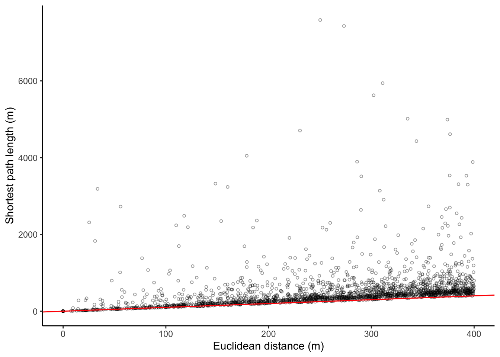
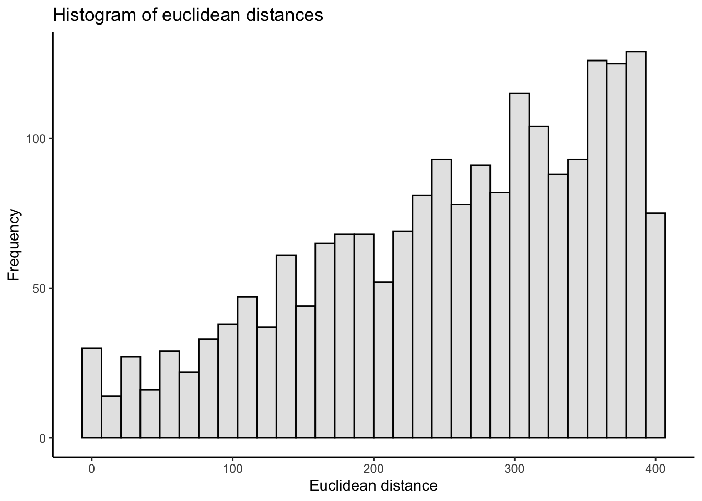
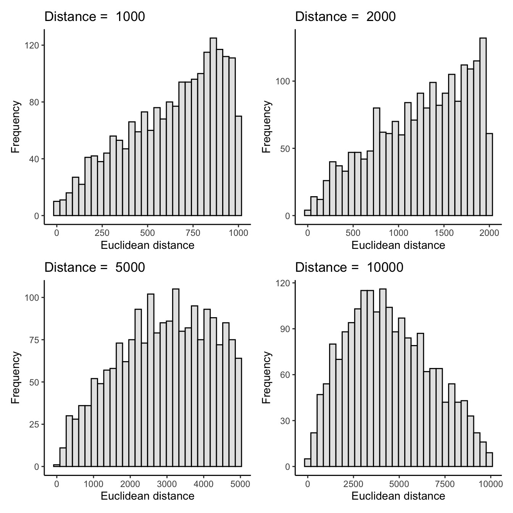
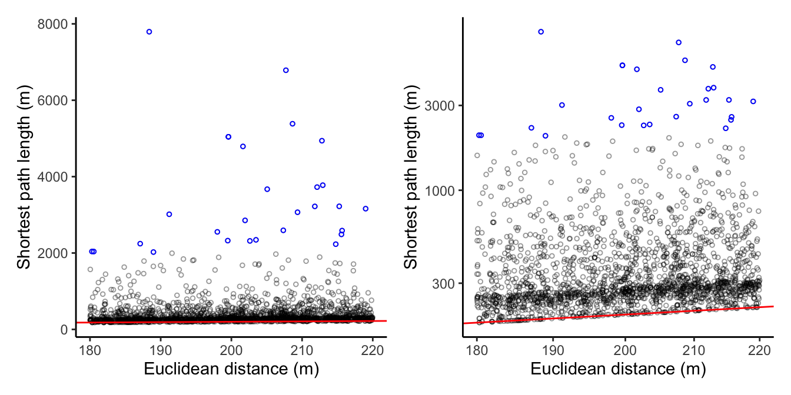

{}
This is the second post in a series. The first post is [here](https://www.woutersteenbeek.nl/post/geometric-road-distance-g4/)
{}

Are [Geographic distance and Road distance highly correlated (in the four largest municipalities of the Netherlands)](https://www.woutersteenbeek.nl/post/geometric-road-distance-g4/)? Well, I may have spoken too soon. In my previous blog post, I compared the geometric distance and the length of the shortest-path along the road network for 2000 starting and end points in the four largest municipalities of the Netherlands. These turned out to be highly correlated.

\*However\*, the final plots in that post showed a striking absence of *short* distances. By randomly selecting intersections within a municipality's borders, I didn't end up with very many short euclidean distances. This was also evident in Andy Wheeler's [post](https://andrewpwheeler.com/2015/04/04/some-more-on-network-distances-vs-geographic-distances-intra-city/) that I tried to replicate. I was planning to publish a follow-up analysis about this in due time, but my colleague Stijn Ruiter immediately asked about this:



Wim Bernasco was wondering the exact same thing (private communication). Therefore I decided to get this second post out asap.

My approach is the same as in my [previous post](https://www.woutersteenbeek.nl/post/geometric-road-distance-g4/), except that I first randomly select 2000 intersections which are each then paired with another intersection at most some specified distance away. I do this using the function `st_buffer()` from the [sf](https://cran.r-project.org/package=sf) package. This function computes a buffer of specified distance around a geometry. For nodes (which are points), this means a circle is drawn. Then, a node is selected that is covered by this circle.

> tl;dr; The high correlation between euclidean distance and shortest-path lengths doesn't hold up for short distances.

## Load packages and data


```r
library(sf)
library(tidygraph)
library(igraph)
library(dplyr)
library(ggplot2)
library(patchwork)
library(tmap)
```


## Data prep

In contrast to my previous blog post, I create a few smaller functions that each do part of the job, facilitating readability later on. I also improved on my earlier code in other small ways, making it easier to read and debug (in my opinion, at least).

Here's the function `muni_prep()` that selects a municipality outline, creates a 5000 meter buffer around this outline, selects the roads that are covered by this polygon, and turns these roads into a tbl_graph object, removing unconnected subgraphs. To the nodes of the graph, a variable `in_poly` is added which value is 1 if the node is located within the municipality's border (without buffer zone) and 0 if it isn't.


```r
muni_prep <- function(municipality_name){
  # select polygon and roads
  mypoly <- muni %>% filter(GM_NAAM == municipality_name & WATER == "NEE")
  mypoly_buffer <- st_buffer(mypoly, 5000)
  myroad <- road_sf[mypoly_buffer, ]
  
  # remove unconnected subgraphs
  touching_list <- sf::st_touches(myroad)
  graph_list <- igraph::graph.adjlist(touching_list)
  roads_groups <- igraph::components(graph_list)
  roads_table <- table(roads_groups$membership)
  roads_table_order <- roads_table[order(roads_table, decreasing = TRUE)]
  biggest_group = names(roads_table_order[1])
  myroad <- myroad[roads_groups$membership == biggest_group, ]
  
  sf_to_tidygraph = function(x, directed = TRUE) {
    # Give edges a unique index
    edges <- x %>%
      mutate(edgeID = c(1:n()))
  
    # Extract beginning and end node for each edge
    nodes <- edges %>%
      st_coordinates() %>%
      as_tibble() %>%
      rename(edgeID = L1) %>%
      group_by(edgeID) %>%
      slice(c(1, n())) %>%
      ungroup() %>%
      mutate(start_end = rep(c('start', 'end'), times = n()/2)) %>%
      mutate(xy = paste(.$X, .$Y)) %>%
      mutate(xy = factor(xy, levels = unique(xy))) %>%
      group_by(xy) %>%
      mutate(nodeID = cur_group_id()) %>%
      ungroup() %>%
      select(-xy)
  
    source_nodes <- nodes %>%
      filter(start_end == 'start') %>%
      pull(nodeID)
  
    target_nodes <- nodes %>%
      filter(start_end == 'end') %>%
      pull(nodeID)
  
    # Specify for each edge in which node it starts and in which node it ends
    edges <- edges %>%
      mutate(from = source_nodes, to = target_nodes)
  
    # Remove duplicate nodes and convert to sf object with correct CRS
    nodes <- nodes %>%
      distinct(nodeID, .keep_all = TRUE) %>%
      select(-c(edgeID, start_end)) %>%
      st_as_sf(coords = c('X', 'Y')) %>%
      st_set_crs(st_crs(edges))
  
    # Convert to tbl_graph object
    tbl_graph(nodes = nodes, edges = as_tibble(edges), directed = directed)
  }
  
  graph <- sf_to_tidygraph(myroad, directed = FALSE)

  graph <- graph %>%
    activate(edges) %>%
    mutate(length = st_length(geometry))

  graph <- graph %>%
    activate(nodes) %>%
    mutate(X = st_coordinates(geometry)[,1],
           Y = st_coordinates(geometry)[,2])
  
  # nodes in municipality
  nodes_in_poly <- st_intersects(mypoly, graph %>% 
                                         activate(nodes) %>% 
                                         as_tibble() %>% 
                                         st_as_sf()) %>% unlist()
  
  # add variable called in_poly to nodes:
  # 1 == present in municipality (without buffer), 0 = not present.
  graph <- graph %>%
    activate(nodes) %>%
    mutate(in_poly = ifelse(row_number() %in% nodes_in_poly, 1, 0))
  
  return(graph)
}

# Call the function
graph_Utrecht <- muni_prep(municipality_name = "Utrecht")
```

## Create 2000 node pairs

Next, I create 2000 node pairs. In contrast to my previous post in which I could simply create random pairings of 4000 nodes---nodes that were located within the municipality proper and not including the buffer zone, that is---this time I will randomly select 2000 nodes within the municipality, and for each of these nodes randomly select another node within a specified distance.


```r
create_node_pairs <- function(graph, n = 2000, dist){
  
  # The nodes within the municipality border
  nodes_sf <- graph %>%
    activate(nodes) %>% 
    filter(in_poly == 1) %>% 
    as_tibble() %>% st_as_sf()

  # Sample `n` of the nodeID
  # I do it without replacement, so 2000 unique points will be selected
  nodeIDs_start <- sort(sample(nodes_sf$nodeID, n, replace = FALSE))
  
  # For each of these, draw a buffer of distance `dist`
  mybuffer_sf <- nodes_sf %>%
    filter(nodeID %in% nodeIDs_start) %>%
    st_buffer(dist = dist)
  
  # nodeIDs of nodes within these buffers:
  my_list <- st_intersects(mybuffer_sf, nodes_sf) # these are row nrs
  my_list <- lapply(my_list, function(rownrs) nodes_sf$nodeID[rownrs])
  # In each of these, sample one.
  # Use safer version of sample(), in case there is no other node nearby, 
  # i.e. the result is just 1 node to sample from (see ?sample)
  resample <- function(x, ...) x[sample.int(length(x), ...)]
  nodeIDs_end <- sapply(my_list, function(ids) resample(ids, 1))
  
  nodeID_pairs <- matrix(data = c(nodeIDs_start, nodeIDs_end), ncol = 2, byrow = FALSE)
  colnames(nodeID_pairs) <- c("id1", "id2")
  return(nodeID_pairs)
}

# Specify distance
mydistance <- 400
# Set seed for reproducibility
set.seed(468)
# Call function
my_node_pairs <- create_node_pairs(graph = graph_Utrecht, n = 2000, dist = mydistance)
```


## As the crow flies

Next is a function to turn the `my_node_pairs` object into a linestring `sf` object, using the `graph_Utrecht` object I created earlier.


```r
node_pairs_to_lines <- function(my_node_pairs, graph){

  # Get the coordinates of the begin and end points, and create a tibble
  eucl_lines <- my_node_pairs %>%
    as_tibble() %>%
    left_join(y = graph %>% activate(nodes) %>% as_tibble %>% select(-geometry), by = c("id1" = "nodeID")) %>%
    left_join(y = graph %>% activate(nodes) %>% as_tibble %>% select(-geometry), by = c("id2" = "nodeID"), suffix = c("_1", "_2"))
  
  # Convert this tibble to a linestring sf object
  # I split-apply-combine per row.
  rows <- split(eucl_lines, seq(nrow(eucl_lines)))
  lines <- lapply(rows, function(row) {
      lmat <- matrix(unlist(row[, c("X_1", "Y_1", "X_2", "Y_2")]), ncol = 2, byrow = TRUE)
      st_linestring(lmat)
    })
  lines <- st_sfc(lines)
  lines_sf <- st_sf("pathID" = seq_len(nrow(eucl_lines)), "geometry" = lines, crs = st_crs(graph %>% activate(edges) %>% as_tibble() %>% st_as_sf())) %>%
    mutate(pathID = factor(pathID))
  
  return(lines_sf)
}

crow_sf <- node_pairs_to_lines(my_node_pairs, graph_Utrecht)
```

## Shortest path along the road network

Continuing, a function to turn the `my_node_pairs` object into a multilinestring `sf` object, which is the collection of linestrings that make up the shortest path from start to end node.


```r
node_pairs_to_paths <- function(my_node_pairs, graph){

  # Identify the paths and save in a list
  mypaths <- lapply(seq_len(nrow(my_node_pairs)), function(i){
    
    eids <- shortest_paths(
      graph = graph,
      from = my_node_pairs[i, 1],
      to = my_node_pairs[i, 2],
      weights = graph %>% activate(edges) %>% pull(length),
      output = "both"
      )$epath %>% unlist()
    
    path_graph <- graph %>%
      subgraph.edges(eids = eids) %>%
      as_tbl_graph()
    
    return(path_graph)
  })

  # Convert every path to an sf object so you have a list of 2000 sf objects,
  # then merge all 2000 together into one sf object,
  # with a pathID variable indicating which path every linestring.
  paths_sf <- lapply(mypaths, function(x){
    mysf <- x %>%
      activate(edges) %>%
      as_tibble() %>%
      st_as_sf()
    return(mysf)
  }) %>%
    bind_rows(.id = "pathID") %>%
    mutate(pathID = factor(as.numeric(pathID)))
  
  return(paths_sf)
}

path_sf <- node_pairs_to_paths(my_node_pairs, graph_Utrecht)
```


## Shortest path length vs euclidean distance

The next function takes the `crow_sf` and the `path_sf` objects and calculates the total length per pathID, and binds these together into a new tibble.


```r
crow_vs_path <- function(lines_sf_object, paths_sf_object){
  # Length of straight lines
  # Easy to just use the function `st_length` on these straight lines
  lengths_crow <- lines_sf_object %>%
    mutate(length_crow = as.numeric(st_length(geometry))) %>%
    as_tibble() %>%
    select(-geometry)
  
  # Length of shortest paths
  lengths_network <- paths_sf_object %>%
    group_by(pathID) %>%
    summarise(length_path = sum(length)) %>%
    as_tibble() %>%
    select(-geometry)

  # Join these into one tibble
  lengths_tbl <- lengths_crow %>%
    left_join(y = lengths_network, by = "pathID") %>%
    dplyr::mutate(length_path = tidyr::replace_na(length_path, 0)) # if start and end are the same, length is NA but should be 0
  
  return(lengths_tbl)
}

crow_vs_path_tbl <- crow_vs_path(lines_sf_object = crow_sf, paths_sf_object = path_sf)
```

## Results (version 1)

I now present the scatter plot of euclidean distance vs length of shortest path.


```r
myplot <- function(mytibble, col = "black", log = FALSE){
  
  # non-logged axes
  plot_cor <- ggplot(data = mytibble, aes(x = length_crow, y = length_path)) +
    geom_point(size = 1, shape = 1, alpha = .4, col = col) +
    labs(x = "Euclidean distance (m)", y = "Shortest path length (m)") +
    geom_abline(intercept = 0, slope = 1, color = "red", size = .5) +
    theme_classic()
  
  if(log) plot_cor <- plot_cor + scale_x_continuous(trans='log10') + scale_y_continuous(trans='log10')
  
  plot_cor
}

myplot(crow_vs_path_tbl, log = FALSE)
```




Here we see differences with my [previous blog post](https://www.woutersteenbeek.nl/post/geometric-road-distance-g4/). At these short distances between two intersections, many of the shortest path along the road network are quite a bit longer than a straight line between them. For reference, I include the red line that indicates x = y. Pearson's $r$ correlation between the two is 0.31, while Pearson's $r$ for the logged versions of both (excluding zeros) is 0.7.

What jumped out at me from this figure is that the mass of the distribution of euclidean distances is at the higher end of the scale: there seem to be more node pairs with longer distances between them. This is more evident when we plot the same figure using the natural log, or by simply plotting a histogram of the euclidean distances between the 2000 (smaller than 400 meters apart) node pairs:[^1]


```r
ggplot(crow_vs_path_tbl, aes(x = length_crow)) +
  geom_histogram(fill = "grey90", color = "black") +
  labs(title = "Histogram of euclidean distances",
       x = "Euclidean distance",
       y = "Frequency") +
  theme_classic()
```



There is a steady increase in the number of node pairs by distance. Now, perhaps there simply aren't that many intersections within such short distances of each other? But I don't buy that. The steadiness of the increasing count made me wonder if this is an artefact of the procedure used to select nodes. Imagine a series of concentric circles. The [annulus](https://en.wikipedia.org/wiki/Annulus_(mathematics)) is the region between two concentric circles. Because the area of a circle is $\pi$ times the radius squared, the area of an annulus is $\pi (R^2 - r^2)$ (with $R > r$). Suppose I define the width of an annulus as $w = R-r$. This $w$ is the same for constant increases in $R$ and $r$: the annulus width from 50 to 100 meters is 100 - 50 = 50 meters; the annulus width from 100 to 150 meters is 150 - 100 = 50 meters; and so on. However, the *areas* of these annuli are quite different: $\pi (100^2 - 50^2)=$ 23562, while $\pi (150^2 - 100^2)=$ 39270, and $\pi (200^2 - 150^2)=$ 54978. If nodes are randomly distributed, there are more nodes the farther away you get from the focal node (within a specified maximum distance). Put differently, a randomly selected node within some buffer area is more likely to be located farther away from the focal node.

## Intermezzo

If the above reasoning is sound then the mass of the distribution will *always* be near the end of the specified buffer size. Or at least until the buffer size is so large as to encompass most of the city. I suppose I could investigate this by randomly selecting a node and then count the number of nodes in differently-sized annuli around this focal node (and repeat this many times). But I could also use the functions I defined above. I'll run the functions a few times but with different (increasing) distances, and plot the histograms of each. I suspect to see a steady increase in the frequency of node pairs up to a certain buffer distance. There will also be a downturn: two randomly selected node pairs aren'y likely to be located 10 kilometers away from each other, because this reaches the limits of the maximum distance between any two points within the municipality of Utrecht, and the chances of these nodes being selected are small.


```r
plot_histogram <- function(mydistance){
  my_node_pairs <- create_node_pairs(graph = graph_Utrecht, n = 2000, mydistance)
  crow_sf <- node_pairs_to_lines(my_node_pairs, graph_Utrecht)
  path_sf <- node_pairs_to_paths(my_node_pairs, graph_Utrecht)
  crow_vs_path_tbl <- crow_vs_path(lines_sf_object = crow_sf, paths_sf_object = path_sf)
  ggplot(crow_vs_path_tbl, aes(x = length_crow)) +
    geom_histogram(fill = "grey90", color = "black") +
    labs(title = paste("Distance = ", mydistance),
         x = "Euclidean distance",
         y = "Frequency") +
    theme_classic()
}

set.seed(1212)
# This uses the package `patchwork` to stitch these ggplot histograms together.
plot_histogram(1000) + 
  plot_histogram(2000) + 
  plot_histogram(5000) + 
  plot_histogram(10000)
```



(Perhaps I needn't have plotted the first three histograms?) The histograms seem to confirm my interpretation of what's happening in the procedure above. And because 10k is at the very high end of the maximum possible distances (i.e., it's almost the same as not using any buffer), this also explains the shape of the scatter plot in my [first post](https://www.woutersteenbeek.nl/post/geometric-road-distance-g4/).

The question is: does this matter? Because the distribution is dominated by node pairs of pretty long distances (2000 meters and longer), and **for these longer distances** the correlation between euclidean distance and shortest-path length is quite high, I think it does matter. The story is more nuanced than the title of my first post.

The example I used before was Near Repeat victimization, in which the spatial and temporal distances between pairs of crimes are used to detect space-time interaction. The idea is that houses *nearby* a house that was burglarized have a higher chance to also be targeted for a short period after the first victimization. The distance between two events is most often calculated using the geometric distance, which, unrealistically, assumes the spatio-temporal process occurs on a continuous space. Measuring the distance between events via the road network seems more sensible, but can get quite complex (and requires up-to-date and high-quality road network data).

The thing is, criminological theory argues that Near Repeat victimization is most likely to occur at relatively short distances: the houses in the same street segment or at most a few street segments away. These are exactly the short distances missing from my earlier analysis. And in the scatter plot presented above, the very short distances (e.g. 0-100 meters) are still underrepresented as compared to larger distances.

Therefore I decided to try another approach for a second set of results. My earlier function `create_node_pairs()` randomly selected a node from the set of nodes that were *at most* a specified distance away from a focal node. Below, I adjust the function to select nodes that are "exactly" a specified distance apart from each other (okay, give or take a small bandwidth for obvious reasons). I will select nodes that are 200 meters apart from each other (as the crow flies) give or take a small bandwidth, say 20 meters. My aim is to get 2000 node pairs, but it's of course possible that there aren't 2000 node pairs that have a distance of 180-220 meters between them.

In the function below I could simply use the function `st_distance()` to calculate the distances between all nodes and then select 2000 that fit my criteria of 180-220 meters distance. However, because the function calculates the full matrix of all nodes * all nodes, this explodes in both computation time and RAM. Therefore I will use `st_buffer()` to create an annulus of 200 meters plus and minus 20 meters, and then randomly select a node that falls within this annulus.


```r
create_node_pairs_dist <- function(graph, n = 2000, dist = 200, width = 20){
  # The nodes within the municipality border
  nodes_sf <- graph %>%
    activate(nodes) %>% 
    filter(in_poly == 1) %>% 
    as_tibble() %>% st_as_sf()
  
  # Shuffle this sf object so we get a random list
  nodes_sf_shuffled <- nodes_sf[sample(nrow(nodes_sf)),]
  nodeIDs_start <- nodes_sf_shuffled$nodeID
  
  # Go 1 by 1, stop when reached n
  # Or stop when all nodes have been investigated
  selected_rownrs <- rep(NA, nrow(nodes_sf_shuffled))
  i <- 1
  while (sum(!is.na(selected_rownrs)) < n){
    ## print i ?
    # if (i %% 100 == 0) print(paste0("i = ", i))
    
    # Draw a buffer of dist + width
    mybuffer_sf_large <- nodes_sf_shuffled[i,] %>%
      st_buffer(dist = dist + width)
    # Draw a buffer of dist - width
    mybuffer_sf_small <- nodes_sf_shuffled[i,] %>%
      st_buffer(dist = dist - width)
    # Take the difference between the buffers to get the annuli
    mybuffer_sf <- st_difference(mybuffer_sf_large, mybuffer_sf_small)
    
    # row nrs of nodes_sf in this annulus
    node_rownrs <- unlist(st_intersects(mybuffer_sf, nodes_sf))
    
    ## Now we can draw a buffer zone:
    # plot(st_geometry(mybuffer_sf[i,]), col = scales::alpha("red", .1), border = NA)
    ## Draw the focal node
    # plot(st_geometry(nodes_sf_shuffled[i,]), pch = 19, col = "red", add = TRUE)
    ## Draw the nodes within the buffer (one of which is always the focal node itself)
    # plot(st_geometry(nodes_sf[node_rownrs, ]), col = scales::alpha("black", .4), add = TRUE)
    
    # Use safer version of sample(), in case there is no other node nearby, 
    # i.e. the result is just 1 node to sample from (see ?sample)
    resample <- function(x, ...) x[sample.int(length(x), ...)]
    # sample one node rownr (or NA if there isn't any)
    if(length(node_rownrs) == 0){
      selected_rownrs[i] <- NA
    } else {
      selected_rownrs[i] <- resample(node_rownrs, 1)  
    }
    i <- i + 1
    if(i >  nrow(nodes_sf_shuffled)) break
  }
  
  nodeIDs_end <- nodes_sf$nodeID[selected_rownrs]
  
  # pair them up, removing when id2 == NA,
  # and arrange them back in order
  nodeID_pairs <- tibble(id1 = nodeIDs_start,
                         id2 = nodeIDs_end) %>%
    filter(!is.na(id2)) %>%
    arrange(id1)
  
  # Output matrix so other function can use it:
  nodeID_pairs <- as.matrix(nodeID_pairs)
  return(nodeID_pairs)
}

# Set seed for reproducibility
set.seed(9766)
# Call function
my_node_pairs_new <- create_node_pairs_dist(graph = graph_Utrecht, n = 2000, dist = 200, width = 20)
```

I can now use the earlier function to calculate the euclidean distance and the length of the shortest path between the nodes.


```r
crow_sf_new <- node_pairs_to_lines(my_node_pairs_new, graph_Utrecht)
path_sf_new <- node_pairs_to_paths(my_node_pairs_new, graph_Utrecht)
crow_vs_path_tbl_new <- crow_vs_path(lines_sf_object = crow_sf_new, paths_sf_object = path_sf_new)
```

Let's plot an interactive map of what happened for a randomly selected 100 node-pairs of these. The blue lines are the straight lines between two nodes and they should all be about the same length:


```r
# Select 100 within the total number of node pairs nrow(my_node_pairs_new)
set.seed(91)
mysample <- sample(nrow(my_node_pairs_new), 100)

mymap <- tm_shape(crow_sf_new %>% filter(pathID %in% mysample)) + 
  tm_lines(col = "blue", lwd = 4, alpha = .6)

tmap_leaflet(mymap + tm_basemap("Stamen.TonerLite"), mode = "view", show = FALSE)
```

<iframe src="geometric-road-g4-short-distance-figures/small_distances.html" width="100%" height="480px"></iframe>

This looks as expected. The histogram of the euclidean distances now looks like this, just as I'd hoped:

```r
ggplot(crow_vs_path_tbl_new, aes(x = length_crow)) +
    geom_histogram(fill = "grey90", color = "black") +
    labs(x = "Euclidean distance",
         y = "Frequency") +
    theme_classic()
```


## Results (version 2)

Thus I end up with nodes that I know are about 200 meters apart (as the crow flies), and for this set I will show the scatter plot with shortest-path length (by simply calling the function defined earlier), with the raw values and natural log thereof. For reference, I include a red line that indicates x = y, and I highlight the node pairs that have a path length over 2000 meters.


```r
myplot(crow_vs_path_tbl_new, log = FALSE) + 
  geom_point(data = crow_vs_path_tbl_new %>% filter(length_path > 2000), size = 1, shape = 1, col = "blue") +
  myplot(crow_vs_path_tbl_new, log = TRUE) + 
  geom_point(data = crow_vs_path_tbl_new %>% filter(length_path > 2000), size = 1, shape = 1, col = "blue")
```



This looks very different than my [previous blog post](https://www.woutersteenbeek.nl/post/geometric-road-distance-g4/)! While many node pairs are still at the lower end of the shortest path length, there are also *many* node pairs for which the road network shortest-path is a LOT longer than the euclidean distance. Let's inspect some of these strong outliers. I won't do anything fancy here, just select the 28 node pairs for which the shortest paths are longer than 2000 meters. Create a `tmap` object for plotting:


```r
# select pathIDs to display
my_pathIDs <- crow_vs_path_tbl_new %>% filter(length_path > 2000) %>% pull(pathID)

# give them distinct colors
tmap_options(max.categories = length(my_pathIDs))

# tmap
mymap <- tm_shape(path_sf_new %>% 
                    filter(pathID %in% my_pathIDs) %>% 
                    mutate(pathID = factor(pathID))) + 
  tm_lines(col = "pathID", palette = "Paired", lwd = 4, alpha = .6) +
  tm_layout(legend.show = FALSE)
```


```r
tmap_leaflet(mymap + tm_basemap("Stamen.TonerLite"), mode = "view", show = FALSE) %>% leaflet::clearControls()
```

<iframe src="geometric-road-g4-short-distance-figures/outliers.html" width="100%" height="480px"></iframe>


## Conclusion

For some of the paths in the map above, the long length might be the (erroneous) result of the quality of the underlying street segment dataset. One example is the segment with `pathID = 888` located in the western part of town. The background map reveals that there are footpaths between the start node and end node that suggests a much shorter path along the road network is possible. Either these paths aren't included in the road dataset I started out with, or they are included but not connected properly (i.e. in the dataset they are cul-de-sacs whereas they are actually connected). For other paths I do see the expected result, such as the blue path `pathID = 264` at the east part of town. There, the start node and end node are divided by train tracks, necessitating a long detour to get from A to B by the road network.

All in all, this follow-up post shows the last hasn't been said about the comparison between euclidean distance and shortest-path road network lengths. **For short distances, these can be vastly different** (even when conceding that some of these might be artefacts of the quality of the street segment data source). It is also worth noting that this post and especially the [former](https://www.woutersteenbeek.nl/post/geometric-road-distance-g4/) do not disqualify street network-based analyses. This was pointed out as much on twitter, including references to research on this topic:



It depends on the specific research question and whether (we think) the spatial processes operate on a continuous space or the road network. Even if the road network is preferred, for some research questions euclidean distances might still be useful approximations of the shortest path lengths (at least, for longer distances). In addition, poor data quality (or absence of road network datasets altogether) might not even allow calculation of shortest paths, which leaves researchers with euclidean distances (or nothing). If nothing else, I hope my posts shed some light on how much euclidean distances approximate the lengths of the shortest-paths along the road network.[^2]

Comments are welcome! (I need a subject for my third post, after all... :smile:)


## R session info


```r
devtools::session_info()
```

```
## ─ Session info ───────────────────────────────────────────────────────────────
##  setting  value                       
##  version  R version 4.0.0 (2020-04-24)
##  os       macOS Catalina 10.15.7      
##  system   x86_64, darwin17.0          
##  ui       X11                         
##  language (EN)                        
##  collate  en_US.UTF-8                 
##  ctype    en_US.UTF-8                 
##  tz       Europe/Amsterdam            
##  date     2020-10-02                  
## 
## ─ Packages ───────────────────────────────────────────────────────────────────
##  package           * version  date       lib source        
##  abind               1.4-5    2016-07-21 [1] CRAN (R 4.0.0)
##  assertthat          0.2.1    2019-03-21 [1] CRAN (R 4.0.0)
##  backports           1.1.7    2020-05-13 [1] CRAN (R 4.0.0)
##  base64enc           0.1-3    2015-07-28 [1] CRAN (R 4.0.0)
##  callr               3.4.3    2020-03-28 [1] CRAN (R 4.0.0)
##  class               7.3-16   2020-03-25 [1] CRAN (R 4.0.0)
##  classInt            0.4-3    2020-04-07 [1] CRAN (R 4.0.0)
##  cli                 2.0.2    2020-02-28 [1] CRAN (R 4.0.0)
##  codetools           0.2-16   2018-12-24 [1] CRAN (R 4.0.0)
##  colorspace          1.4-1    2019-03-18 [1] CRAN (R 4.0.0)
##  crayon              1.3.4    2017-09-16 [1] CRAN (R 4.0.0)
##  crosstalk           1.1.0.1  2020-03-13 [1] CRAN (R 4.0.0)
##  DBI                 1.1.0    2019-12-15 [1] CRAN (R 4.0.0)
##  desc                1.2.0    2018-05-01 [1] CRAN (R 4.0.0)
##  devtools            2.3.0    2020-04-10 [1] CRAN (R 4.0.0)
##  dichromat           2.0-0    2013-01-24 [1] CRAN (R 4.0.2)
##  digest              0.6.25   2020-02-23 [1] CRAN (R 4.0.0)
##  dplyr             * 1.0.2    2020-08-18 [1] CRAN (R 4.0.2)
##  e1071               1.7-3    2019-11-26 [1] CRAN (R 4.0.0)
##  ellipsis            0.3.1    2020-05-15 [1] CRAN (R 4.0.0)
##  evaluate            0.14     2019-05-28 [1] CRAN (R 4.0.0)
##  fansi               0.4.1    2020-01-08 [1] CRAN (R 4.0.0)
##  farver              2.0.3    2020-01-16 [1] CRAN (R 4.0.0)
##  fs                  1.4.1    2020-04-04 [1] CRAN (R 4.0.0)
##  generics            0.0.2    2018-11-29 [1] CRAN (R 4.0.0)
##  ggplot2           * 3.3.2    2020-06-19 [1] CRAN (R 4.0.2)
##  glue                1.4.2    2020-08-27 [1] CRAN (R 4.0.2)
##  gtable              0.3.0    2019-03-25 [1] CRAN (R 4.0.0)
##  htmltools           0.4.0    2019-10-04 [1] CRAN (R 4.0.0)
##  htmlwidgets         1.5.1    2019-10-08 [1] CRAN (R 4.0.0)
##  igraph            * 1.2.5    2020-03-19 [1] CRAN (R 4.0.0)
##  jsonlite            1.6.1    2020-02-02 [1] CRAN (R 4.0.0)
##  KernSmooth          2.23-16  2019-10-15 [1] CRAN (R 4.0.0)
##  knitr               1.28     2020-02-06 [1] CRAN (R 4.0.0)
##  labeling            0.3      2014-08-23 [1] CRAN (R 4.0.0)
##  lattice             0.20-41  2020-04-02 [1] CRAN (R 4.0.0)
##  leafem              0.1.1    2020-04-05 [1] CRAN (R 4.0.0)
##  leaflet             2.0.3    2019-11-16 [1] CRAN (R 4.0.0)
##  leaflet.providers   1.9.0    2019-11-09 [1] CRAN (R 4.0.0)
##  leafsync            0.1.0    2019-03-05 [1] CRAN (R 4.0.2)
##  lifecycle           0.2.0    2020-03-06 [1] CRAN (R 4.0.0)
##  lwgeom              0.2-3    2020-04-12 [1] CRAN (R 4.0.0)
##  magrittr            1.5      2014-11-22 [1] CRAN (R 4.0.0)
##  memoise             1.1.0    2017-04-21 [1] CRAN (R 4.0.0)
##  munsell             0.5.0    2018-06-12 [1] CRAN (R 4.0.0)
##  patchwork         * 1.0.0    2019-12-01 [1] CRAN (R 4.0.0)
##  pillar              1.4.6    2020-07-10 [1] CRAN (R 4.0.2)
##  pkgbuild            1.0.8    2020-05-07 [1] CRAN (R 4.0.0)
##  pkgconfig           2.0.3    2019-09-22 [1] CRAN (R 4.0.0)
##  pkgload             1.0.2    2018-10-29 [1] CRAN (R 4.0.0)
##  png                 0.1-7    2013-12-03 [1] CRAN (R 4.0.0)
##  prettyunits         1.1.1    2020-01-24 [1] CRAN (R 4.0.0)
##  processx            3.4.2    2020-02-09 [1] CRAN (R 4.0.0)
##  ps                  1.3.3    2020-05-08 [1] CRAN (R 4.0.0)
##  purrr               0.3.4    2020-04-17 [1] CRAN (R 4.0.0)
##  R6                  2.4.1    2019-11-12 [1] CRAN (R 4.0.0)
##  raster              3.1-5    2020-04-19 [1] CRAN (R 4.0.0)
##  RColorBrewer        1.1-2    2014-12-07 [1] CRAN (R 4.0.0)
##  Rcpp                1.0.4.6  2020-04-09 [1] CRAN (R 4.0.0)
##  remotes             2.1.1    2020-02-15 [1] CRAN (R 4.0.0)
##  rlang               0.4.7    2020-07-09 [1] CRAN (R 4.0.2)
##  rmarkdown           2.3      2020-06-18 [1] CRAN (R 4.0.2)
##  rprojroot           1.3-2    2018-01-03 [1] CRAN (R 4.0.0)
##  scales              1.1.1    2020-05-11 [1] CRAN (R 4.0.0)
##  sessioninfo         1.1.1    2018-11-05 [1] CRAN (R 4.0.0)
##  sf                * 0.9-6    2020-09-13 [1] CRAN (R 4.0.2)
##  sp                  1.4-1    2020-02-28 [1] CRAN (R 4.0.0)
##  stars               0.4-3    2020-07-08 [1] CRAN (R 4.0.2)
##  stringi             1.4.6    2020-02-17 [1] CRAN (R 4.0.0)
##  stringr             1.4.0    2019-02-10 [1] CRAN (R 4.0.0)
##  testthat            2.3.2    2020-03-02 [1] CRAN (R 4.0.0)
##  tibble              3.0.3    2020-07-10 [1] CRAN (R 4.0.2)
##  tidygraph         * 1.2.0    2020-05-12 [1] CRAN (R 4.0.2)
##  tidyr               1.0.3    2020-05-07 [1] CRAN (R 4.0.0)
##  tidyselect          1.1.0    2020-05-11 [1] CRAN (R 4.0.0)
##  tmap              * 3.2      2020-09-15 [1] CRAN (R 4.0.0)
##  tmaptools           3.1      2020-07-01 [1] CRAN (R 4.0.2)
##  units               0.6-6    2020-03-16 [1] CRAN (R 4.0.0)
##  usethis             1.6.1    2020-04-29 [1] CRAN (R 4.0.0)
##  vctrs               0.3.4    2020-08-29 [1] CRAN (R 4.0.2)
##  viridisLite         0.3.0    2018-02-01 [1] CRAN (R 4.0.0)
##  withr               2.2.0    2020-04-20 [1] CRAN (R 4.0.0)
##  xfun                0.14     2020-05-20 [1] CRAN (R 4.0.0)
##  XML                 3.99-0.3 2020-01-20 [1] CRAN (R 4.0.0)
##  yaml                2.2.1    2020-02-01 [1] CRAN (R 4.0.0)
## 
## [1] /Library/Frameworks/R.framework/Versions/4.0/Resources/library
```


[^1]: There are node pairs with zero distance, i.e. the same node was selected. This happens when, from the available nodes within a specified buffer radius around the focal node, the focal node itself was randomly selected. Also, perhaps some nodes don't have any other nodes located within the specified distance (especially for very short distances), in which case the focal node is selected because there are no alternatives available.

[^2]: And I get to play around with R, which is a not-to-be-underestimated reason for writing these posts.
