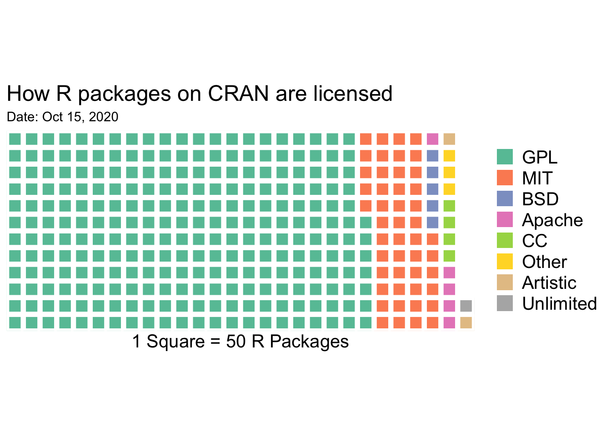
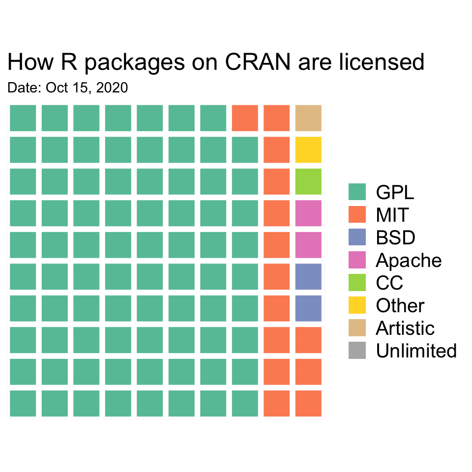
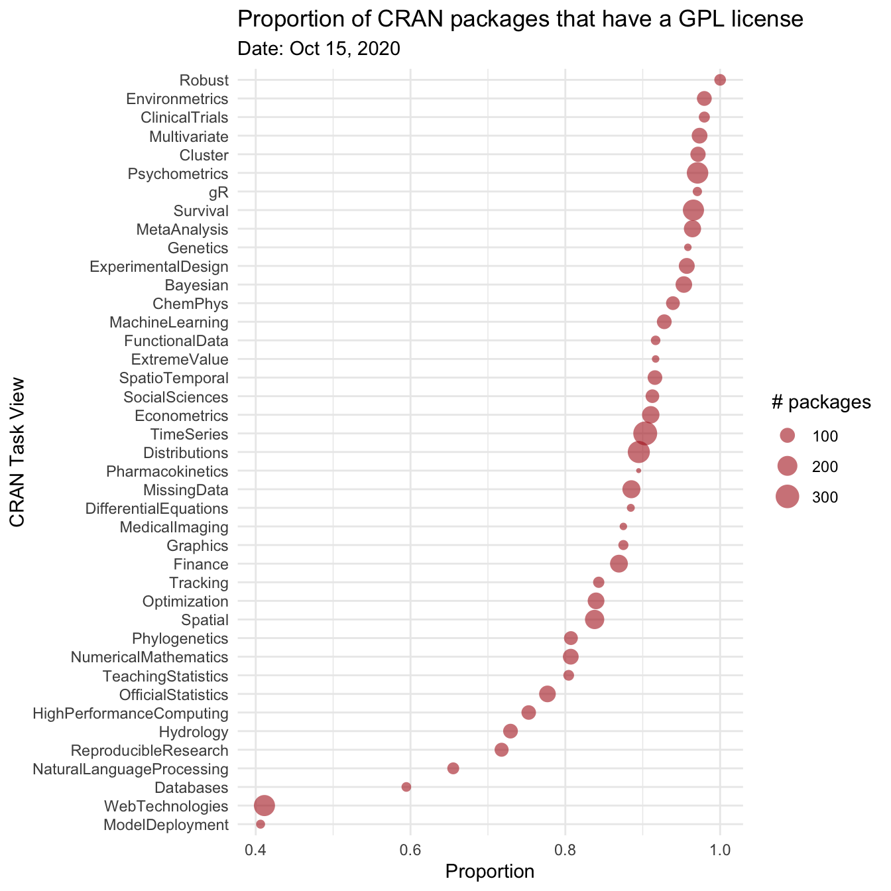
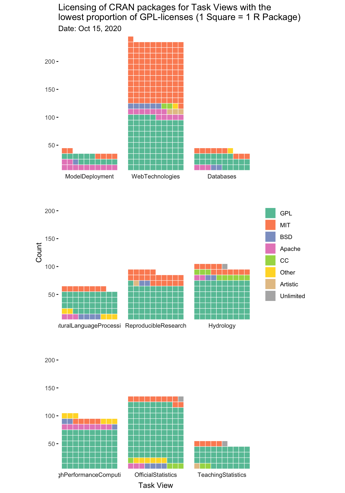
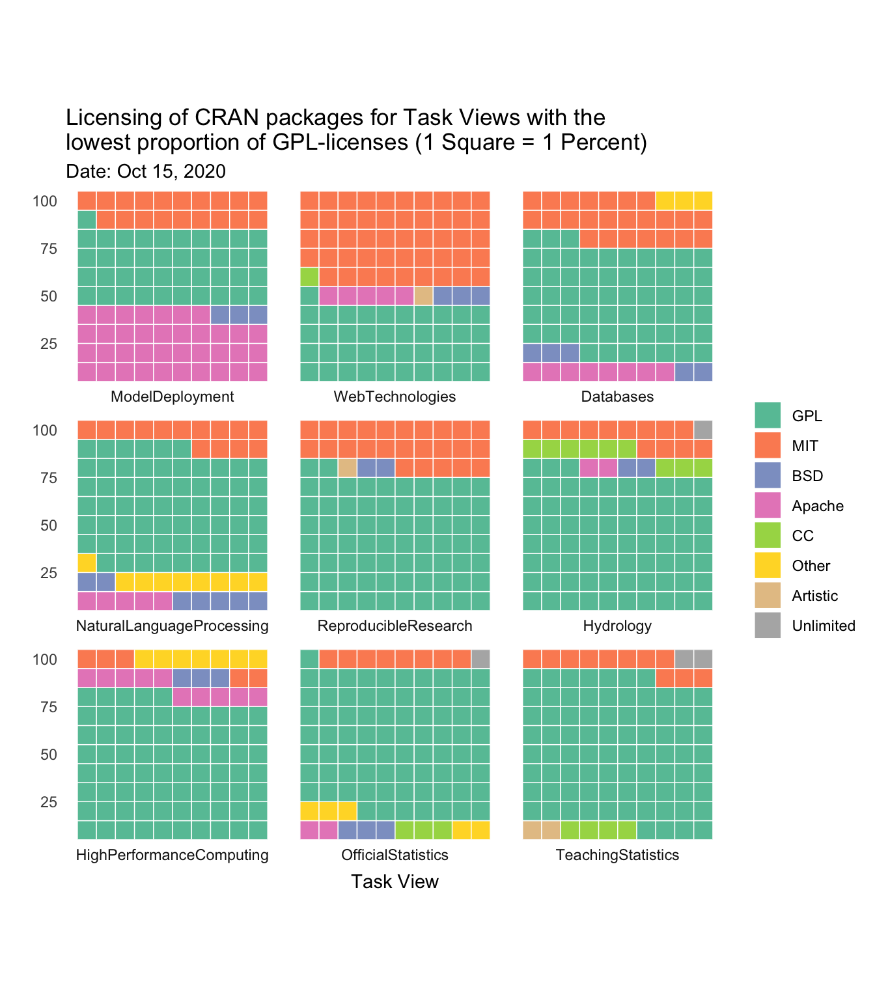

As stated in the ['Writing R extensions' manual](https://cran.r-project.org/doc/manuals/r-release/R-exts.html#Licensing):

> "It is very important that you include license information! Otherwise, it may not even be legally correct for others to distribute copies of the package, let alone use it."

Choosing any license is better than no license. It allows others to use and/or modify your code. The biggest difference between licenses is not so much in what you can do with the code itself, but the *downstream* effects, i.e. what is legally permissible after you've incorporated said code into your own software. There are two main flavors:

- *Permissive* licenses only have the restriction that the license must be preserved. For example, the MIT license "permits reuse within proprietary software, provided that either all copies of the licensed software include a copy of the MIT License terms and the copyright notice, or the software is re-licensed to remove this requirement" ([source](https://en.wikipedia.org/wiki/MIT_License)).

- Protective or *copyleft* licenses, on the other hand, allow you to freely copy and modify the code, but derivative work (i.e. modified versions or bundled together with other code) must be distributed under the same or equivalent license terms. Basically these licenses give "programmers [...] the assurance that their work benefit the whole world and remain free, rather than being exploited by software companies that would not have to give anything back to the community" ([source](https://en.wikipedia.org/wiki/GNU_General_Public_License#cite_note-13)).

R itself is licensed under [GPL-v2](https://en.wikipedia.org/wiki/GNU_GPL#Version_2), a copyleft license. But how are user-contributed R packages licensed? In their amazing [R Packages book](https://r-pkgs.org/), Hadley Wickham and Jennifer Bryan refer to [Sean Kross's blog post](https://seankross.com/2016/08/02/How-R-Packages-are-Licensed.html) that displays a waffle chart of the licenses of CRAN packages. Waffle charts are "square pie charts", and while most people seem to dislike pie charts (try Googling "should I use pie chart")[^1], most people seem to like waffle charts. Waffle charts are usually a 10x10 grid, with each cell representing 1%, but in Sean Kross's blog post each cell represents 50 R packages (i.e. a count instead of a percentage of the total number of packages). His post is several years old, and I wanted to see what his waffle chart looks like in 2020.[^2] I first reproduce Sean Kross's waffle chart (slightly altered to include an extra category):


```r
# install.packages("pacman")
pacman::p_load(dplyr, magrittr, purrr, ggplot2)

# remotes::install_github("hrbrmstr/waffle")
library(waffle)

# The sorting hat will map the License field in a DESCRIPTION file
# to an open source license family.
sorting_hat <- function(student, houses){
  choice <- map_lgl(houses, grepl, x = student)
  if(!any(choice)){
    return("Other")
  } else {
    return((houses[choice])[1])
  }
}

# Get the data from CRAN
cran_packages <- available.packages(repos = "https://cloud.r-project.org/")
license_table <- table(cran_packages[,"License"])

# Sort licenses into families
sorting_vector <- c("GPL", "MIT", "CC", "BSD", "Artistic", "Apache", "Unlimited")
names(license_table) %<>%
  map_chr(function(x){
    sorting_hat(x, sorting_vector)
  })

# Tidy the data
license_tbl <- as.data.frame(license_table) %>%
  rename(License = Var1) %>%
  group_by(License) %>%
  summarize(Freq = sum(Freq)) %>%
  arrange(desc(Freq)) %>%
  mutate(License = factor(License, levels = License))

waffle(license_tbl %>% mutate(Freq = Freq / 50), rows = 12,
       title = "How R packages on CRAN are licensed",
       xlab = "1 Square = 50 R Packages") +
  theme(legend.text=element_text(size=15), axis.title.x = element_text(size=15)) +
  labs(subtitle = paste("Date:", format(Sys.Date(), "%b %d, %Y")))
```



The same waffle chart as a 10x10 grid, with each cell representing 1%, looks like this:


```r
waffle(license_tbl %>% mutate(Freq = round(Freq / sum(Freq) * 100)), rows = 10,
       title = "How R packages on CRAN are licensed") +
  theme(legend.text=element_text(size=15), axis.title.x = element_text(size=15)) +
  labs(subtitle = paste("Date:", format(Sys.Date(), "%b %d, %Y")))
```



I wondered whether licensing of R packages differs by *Task View*. CRAN [Task Views](https://cran.r-project.org/web/views/) give an overview of which CRAN packages are relevant for tasks related to a certain topic. To create a waffle chart per Task View, I first need to match all packages from `available.packages()` to their Task View.


```r
# Download Views.rds
download.file("http://cran.r-project.org/src/contrib/Views.rds", destfile = "TaskViews.rds")
allTaskViews <- readRDS("TaskViews.rds")

# The names of all task views
allTaskViews_names <- sapply(allTaskViews, function(x) x[["name"]])

# Give list elements names
names(allTaskViews) <- allTaskViews_names
```

And then I generate the frequency tables of package licenses for all Task Views:


```r
# Create frequency tables of all packages per taskview
prepped_data <- lapply(allTaskViews, function(mytaskview){
  
  my_taskview_packages <- mytaskview$packagelist$name
  my_cran_packages <- cran_packages[which(cran_packages[, "Package"] %in% my_taskview_packages),]
  
  license_table <- table(my_cran_packages[,"License"])
  
  # Sort licenses into families
  names(license_table) %<>%
    map_chr(function(x){
      sorting_hat(x, sorting_vector)
    })  
  
  # Tidy the data
  license_tbl <- as.data.frame(license_table) %>%
    rename(License = Var1) %>%
    group_by(License) %>%
    summarize(Freq = sum(Freq)) %>%
    mutate(License = factor(License, levels = levels(license_tbl$License)))
  
  return(license_tbl)
})

# Calculate total # packages and proportions per Task View
prepped_data <- bind_rows(prepped_data, .id = "TaskView") %>%
  group_by(TaskView) %>%
  mutate(n_packages = sum(Freq),
         prop = Freq / n_packages) %>%
  ungroup()
```

There are 41 Task Views as of October 13, 2020. I won't make waffle charts of all 41 of them, but highlight a few. Because of the abundance of GPL licenses, I'll use the proportion of GPL licenses as a crude method to select a few Task Views:


```r
ggplot(prepped_data %>% filter(License == "GPL"), aes(x = prop, y = reorder(TaskView, prop), size = n_packages)) +
  geom_point(color = "firebrick", pch = 16, alpha = .6) +
  labs(title = "Proportion of CRAN packages that have a GPL license",
       subtitle = paste("Date:", format(Sys.Date(), "%b %d, %Y")),
       x = "Proportion",
       y = "CRAN Task View",
       size = "# packages") +
  theme_minimal()
```



While there are a few Task Views with a good proportion of packages with non-GPL licenses, many are dominated by GPL. Maybe I'll dive more deeply into the different GPL licenses in a future blog post, but for now I'll keep them lumped together. I'll select and plot the nine Task Views with the lowest number of GPL-licensed packages. 


```r
# Define which Task Views to plot
selected_taskviews <- prepped_data %>%
  filter(License == "GPL") %>%
  arrange(prop) %>% 
  slice(1:9) %>% 
  pull(TaskView)

# Faceted waffle chart
prepped_data %>% 
  filter(TaskView %in% selected_taskviews) %>%
  ggplot(aes(fill = License, values = Freq)) +
    geom_waffle(color = "white", size = .25, n_rows = 10, flip = TRUE,
                make_proportional = FALSE) +
    facet_wrap(~ factor(TaskView, levels = selected_taskviews), nrow = 3, strip.position = "bottom") +
    scale_x_discrete() + 
    scale_y_continuous(labels = function(x) x * 10, # make this multiplyer the same as n_rows
                       expand = c(0,0)) +
    scale_fill_brewer(name = NULL, palette = "Set2") +
    coord_equal() +
    labs(
      title = "Licensing of CRAN packages for Task Views with the\nlowest proportion of GPL-licenses (1 Square = 1 R Package)",
      subtitle = paste("Date:", format(Sys.Date(), "%b %d, %Y")),
      x = "Task View",
      y = "Count"
    ) +
    theme_minimal() +
    theme(panel.grid = element_blank(), axis.ticks.y = element_line())
```



Because they differ substantially in # of packages, I'll also plot the waffle charts using proportions instead of raw counts.

```r
# Faceted waffle chart
prepped_data %>% 
  filter(TaskView %in% selected_taskviews) %>%
  ggplot(aes(fill = License, values = Freq)) +
    geom_waffle(color = "white", size = .25, n_rows = 10, flip = TRUE,
                make_proportional = TRUE) +
    facet_wrap(~ factor(TaskView, levels = selected_taskviews), nrow = 3, strip.position = "bottom") +
    scale_x_discrete() + 
    scale_y_continuous(labels = function(x) x * 10, # make this multiplyer the same as n_rows
                       expand = c(0,0)) +
    scale_fill_brewer(name = NULL, palette = "Set2") +
    coord_equal() +
    labs(
      title = "Licensing of CRAN packages for Task Views with the\nlowest proportion of GPL-licenses (1 Square = 1 Percent)",
      subtitle = paste("Date:", format(Sys.Date(), "%b %d, %Y")),
      x = "Task View",
      y = ""
    ) +
    theme_minimal() +
    theme(panel.grid = element_blank(), axis.ticks.y = element_blank())
```




Many R packages use a GPL license. These guarantee end users the freedom to run, study, share, and modify software. And they ensure the derivative work is distributed under the same or equivalence license terms, "paying it forward" so the whole community gets a chance to benefit from the new software. For companies that want to integrate code of R packages into their commercial products, this poses a potential problem. The other day I was reading [this blog post](https://r-posts.com/how-gpl-makes-me-leave-r-for-python/) by Hovav Dror. Simply put, the author, an employee for a private company, was leaving R for Python because many R packages use a strong GPL license (see [wikipedia](https://en.wikipedia.org/wiki/GNU_General_Public_License) and the [GPL-3 license](https://www.gnu.org/licenses/gpl-3.0.html)). He writes:

> "Working for a private company, our code needs to be proprietary. Our core is not services, but the software itself. We need to avoid handing our source code to a customer. The program itself will be installed on a customer’s server. Most of our customers have sensitive data and a SAAS model (or a connection to the internet) is out of the question. Can we use R?"

Long story short: the advice after consulting with several software lawyers was to not use R, and therefore the blog post author was switching to Python. That's indeed the downside (or upside: it's in the eye of the beholder, I guess) of the protective license of many R packages: (for-profit) companies may not be too keen to use R because this limits them in their commercialization opportunities. In contrast, [Python's license](https://docs.python.org/3/license.html) is compatible with the GPL but is *not* a copyleft license.

<iframe src="https://giphy.com/embed/WqdbPTfc0ZuyRN0lAT" width="576" height="288" frameBorder="0" class="giphy-embed" allowFullScreen></iframe>


[^1]: For a counter-argument, see [here](https://medium.com/@clmentviguier/the-hate-of-pie-charts-harms-good-data-visualization-cc7cfed243b6).

[^2]: Wickham & Bryan write that as of 2020, "~70% of CRAN packages use a copyleft license and ~15% use a permissive license", following this same blog post, but don't show the waffle chart.
